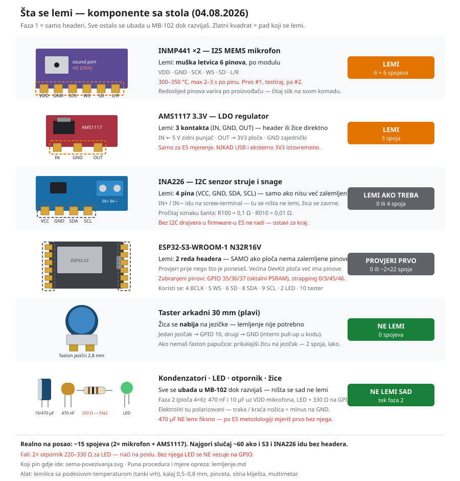

# Lemljenje — kratka verzija (šta ponijeti, šta na šta)

> Provjereno na stvarnim komadima 05.08.2026. Puna procedura: [lemljenje.md](lemljenje.md) ·
> Koji pin gdje ide: [sema-povezivanja.svg](sema-povezivanja.svg)



## 1. Lemi se samo dvoje — mikrofoni i INA226

| Komponenta | Stanje kako je stiglo | Lemi? | Spojeva |
|---|---|---|---|
| **ESP32-S3** | **bez pinova** — idu 40-pinske letvice | **DA** | ~44 (2×22) |
| **INMP441 ×2** | 6 rupa, uz svaki modul 2 letvice po 3 pina (nezalemljene) | **DA** | 6 + 6 |
| **INA226** | 8 rupa, stigla letvica od 8 pinova (nezalemljena) | **DA** | 8 |
| **AMS1117 3.3V** | **4 muška pina već zalemljena** | **NE** | 0 |
| Taster arkadni | faston jezičci 2,8 mm | **NE** — žica se nabija | 0 |
| Kondenzatori, LED, otpornik | nožice | **NE sad** — ubada se u MB-102 | 0 |
| Ploča 4×6 | prazna | **NE sad** — faza 2 | 0 |

**Ukupno na posao: ~64 spoja.** Računaj 1,5–2 h mirnog rada.

Materijal se poklapa: 2× letvica 40 pin = 80 pinova, za S3 treba ~44 → ostaje 36 rezerve.

## 2. Ponesi na posao

- **ESP32-S3 ploču** + obje letvice od 40 pinova
- **INMP441 #1 i #2** + njihove letvice 2×3
- **INA226** + letvica od 8 pinova

Sve ostalo **ostavi kod kuće**: AMS1117 (gotov), taster, kondenzatore, LED, ploču 4×6.

**Redoslijed na poslu:** prvo S3 (najviše pinova, pad-ovi su veliki i praštaju — tu podesiš
lemilicu), pa INA226, pa **mikrofoni na kraju** kad si uhodan — oni su jedini krhki.

## 3. Šta se za šta lemi

### INMP441 (×2) — 6 pinova, dvije letvice po 3

Dvije letvice od 3 pina spoje se u **isti red** (rupe su u jednom redu, pitch 2.54 mm).
Zalemljeni pinovi se poslije ubadaju u MB-102.

| Pin mikrofona | Ide na S3 |
|---|---|
| VDD | 3V3 |
| GND | GND |
| SCK | GPIO 4 |
| WS | GPIO 5 |
| SD | GPIO 6 |
| L/R | **GND** (obavezno — bez toga nema zvuka na lijevom slotu) |

### INA226 — 8 pinova, koristi se 6

Zalemi **svih 8** (mehanička stabilnost), ali priključuješ samo 6:

| Pin | Ide na |
|---|---|
| VCC | 3V3 |
| GND | GND |
| SDA | GPIO 8 |
| SCL | GPIO 9 |
| IN+ | dolazi 5 V sa izvora |
| IN− | ide dalje na potrošač (ESP32) |
| VBS, ALE | ostaju prazni |

> **Redoslijed pinova varira po proizvođaču — čitaj silk oznake na ploči, ne crtež.**
> Šant: oznaka `R100` = 0,1 Ω, `R010` = 0,01 Ω.

### AMS1117 — ne lemi se

Ima 4 muška pina već zalemljena (IN · GND · OUT · GND — provjeri silk).
Ženski jumper ide direktno: IN ← 5 V zidni punjač, OUT → 3V3 ploče, GND zajednički.
Samo za E5, i **nikad istovremeno sa USB napajanjem**.

### ESP32-S3 — 2 reda headera (nema pinove)

1. **Prebroj rupe** po redu prije sječenja — obično 22 (ukupno 44), može biti i 20.
2. Presiječi letvicu na tačnu dužinu (zarezni kliještima pa prelomi).
3. **Ubodi obje letvice u MB-102** tako da preskaču kanal u sredini, nasloni ploču odozgo —
   breadboard je drži pod 90°.
4. Zalemi **po jedan ugaoni pin sa svake strane**, provjeri da ploča stoji ravno, tek onda ostale.
5. Idi redom, 2–3 s po pinu. Ako se pad pregrije i ne prima kalaj — pauza pa nazad.

Pinovi su fiksirani u [pins.h](../firmware/esp32s3_asd/main/pins.h):
4 BCLK · 5 WS · 6 SD · 8 SDA · 9 SCL · 2 LED · 10 taster.
Zabranjeni: GPIO 35/36/37 (oktalni PSRAM), strapping 0/3/45/46.

> Zalemljena ploča više **ne staje na uzak breadboard** ako je šira od kanala — MB-102 (830 rupa)
> je dovoljno širok, ali provjeri da ti sa svake strane ostane bar 1 red rupa za jumpere.

## 4. Šta sa dvoslojnom pločom 4×6?

**Za sad ništa — ostavi je u kesi.** To je za **fazu 2**, finalni zalemljeni sklop za odbranu.

Kad cijeli lanac proradi na MB-102, na nju se lemi: mikrofon (ili ženski header za njega),
470 nF + 10 µF uz VDD mikrofona, LED + otpornik, kratke žice (<10 cm). Pertinaks, rupe
2.54 mm, svaki pad je zasebno ostrvce — veze praviš žicom ili kalajnim mostom.

Razlog: na breadboardu žice ispadaju i duge I2S linije hvataju šum; za demo hoćeš čvrst sklop.

## 5. Nađi na poslu

| Šta | Kom | Zašto |
|---|---|---|
| **Otpornik 220–330 Ω** (1/4 W) | 2 | **Obavezno** — bez njega LED ne ide na GPIO, spržiš pin |
| Keramika **100 nF X7R** | 2–3 | Opciono — datasheet-tačna vrijednost za mikrofon (bolja od 470 nF koju imaš) |
| Ženski header 2.54 mm | 1 | Opciono — da INMP441 ostane vadiv na ploči 4×6 |
| Lemilica sa podesivom temp., tanki vrh | — | 300–350 °C |
| Kalaj 0,5–0,8 mm, pinceta, sitna kliješta, multimetar | — | Multimetar je obavezan za bring-up |

## 6. Redoslijed

```
0. Na poslu: headeri na S3 (~44), INA226 (8), pa mikrofoni (6+6)
1. Kod kuće: ubodi S3 u MB-102, flešuj — provjeri da se ploča i dalje javlja
2. Spoji INMP441 na S3 (4/5/6, VDD/GND, L/R→GND)
3. TEST: snimi 5 s WAV na flash → Audacity    ← ovdje se vidi je li mikrofon živ
4. Eval mod (taster pri bootu) → klipovi s flasha
5. Živi rad → LED reaguje
6. INA226 + AMS1117 → E5, tek poslije I2C drajvera
7. NA KRAJU: sve na ploču 4×6 (faza 2)
```

## ⚠️ Tri stvari koje te mogu koštati

1. **INMP441 je jedina komponenta koju možeš uništiti.** 300–350 °C, **max 2–3 s po pinu**,
   pauza između. **Ne diraj sound port** (ni prstom, ni fluksom, ni izopropanolom),
   **ne peri ploču** poslije. Uzemlji se prije vađenja iz kese. Zato lemiš jedan po jedan.
2. **Otpornici fale** — bez 220–330 Ω ne vezuj LED na GPIO.
3. **Firmware pali samo jednu LED (GPIO 2).** Imaš crvenu i zelenu; za obje treba GPIO 11
   + izmjena u [app_main.c](../firmware/esp32s3_asd/main/app_main.c). Za sad zalemi zelenu
   (svijetli = normal, gasi se pri anomaliji).
