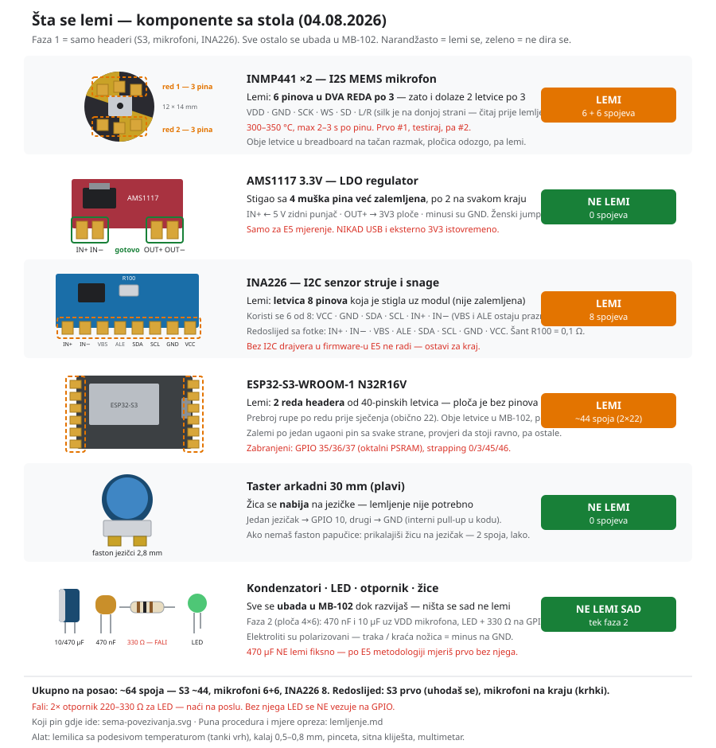
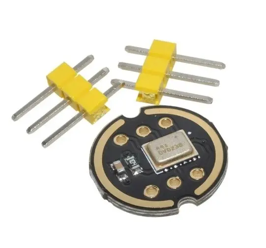
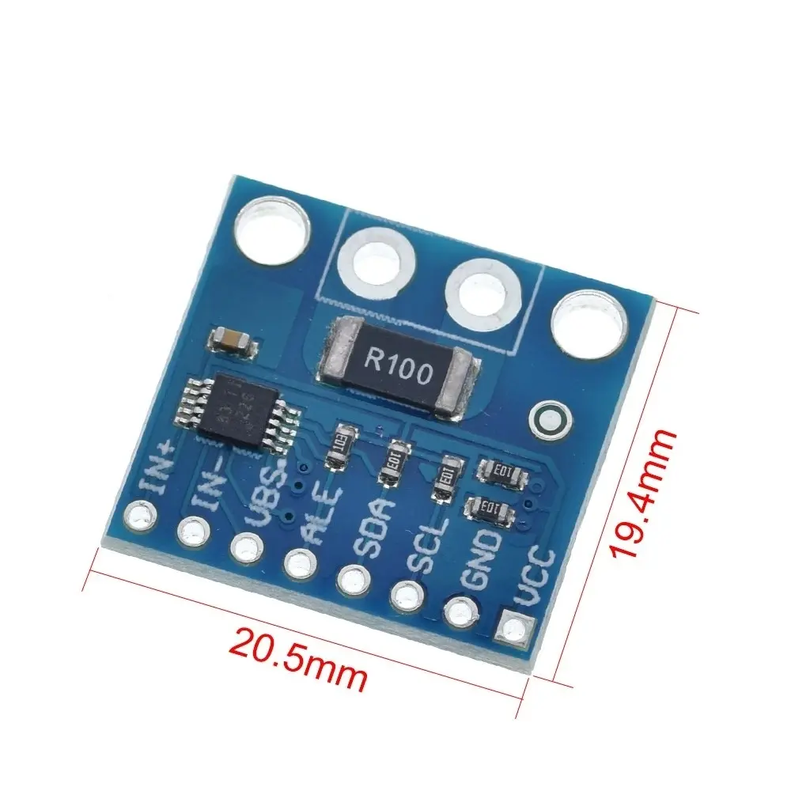
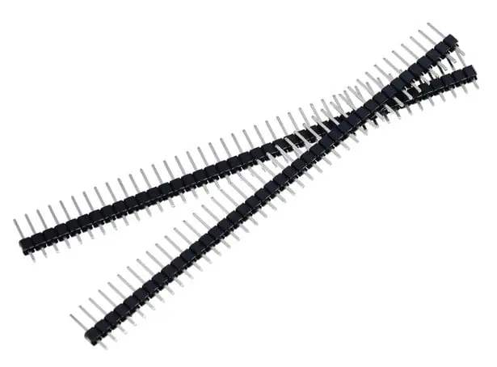
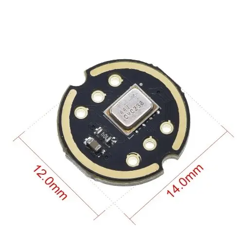
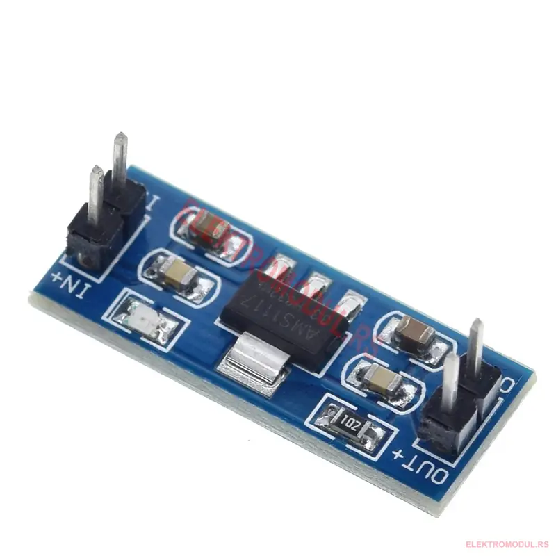
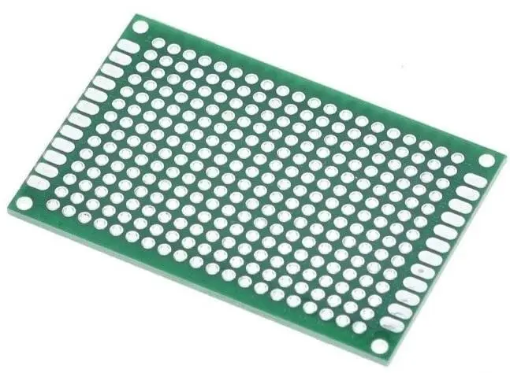
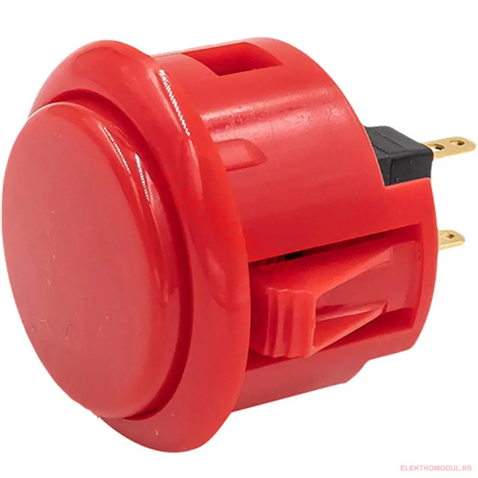
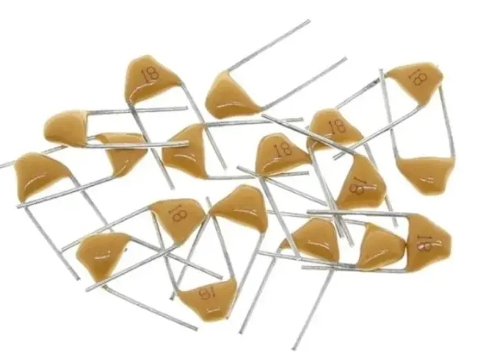
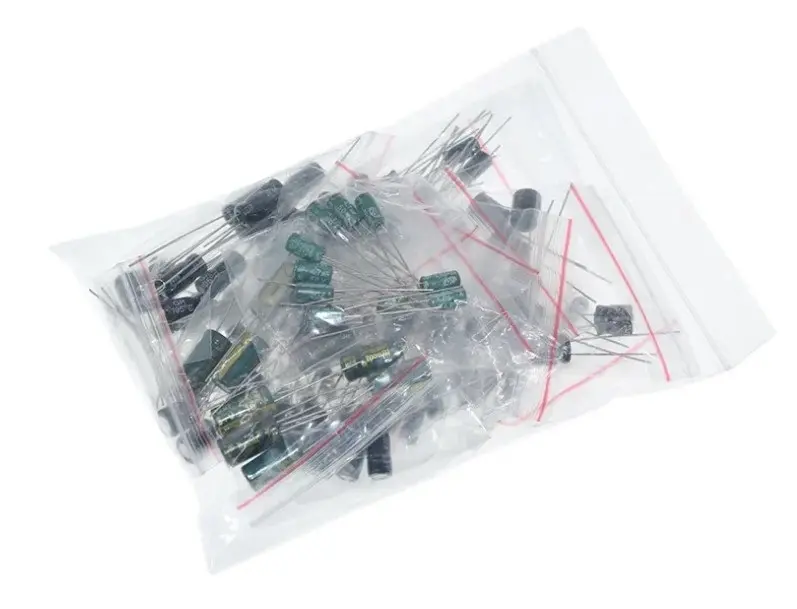

# Lemljenje — kratka verzija (šta ponijeti, šta na šta)

> Provjereno na stvarnim komadima + fotkama sa elektromodul.rs, 05.08.2026.
> Puna procedura: [lemljenje.md](lemljenje.md) · Šema spajanja: [sema-povezivanja.svg](../seme/sema-povezivanja.svg)



## 1. Lemi se troje

| Komponenta | Kako je stiglo | Lemi? | Spojeva |
|---|---|---|---|
| **ESP32-S3** | bez pinova, idu 40-pinske letvice | **DA** | ~44 (2×22) |
| **INMP441 ×2** | 6 rupa u 2 reda po 3 + 2 letvice po 3 pina | **DA** | 6 + 6 |
| **INA226** | 8 rupa u jednom redu + letvica od 8 | **DA** | 8 |
| **AMS1117 3.3V** | 4 muška pina **već zalemljena** | **NE** | 0 |
| Taster arkadni | faston jezičci 2,8 mm | **NE** — žica se nabija | 0 |
| Kondenzatori, LED, otpornik | nožice | **NE sad** — ubada se u MB-102 | 0 |
| Ploča 4×6 | prazna | **NE sad** — faza 2 | 0 |

**Ukupno ~64 spoja.** Računaj 1,5–2 h mirnog rada.

Bilans letvica: 2× 40 = 80 pinova, S3 troši ~44 → 36 rezerve. Mikrofoni i INA226 su došli
sa svojim letvicama, pa se 80 pinova troši **samo na S3**.

---

## 2. Ponesi na posao

| | Komponenta | Šta nosiš uz nju |
|---|---|---|
|  | **INMP441 ×2** | obje letvice po 3 pina, po miku |
|  | **INA226** | letvica od 8 pinova |
|  | **Letvica 40 pin ×2** | za ESP32-S3 |
| | **ESP32-S3 ploča** | — |

Sve ostalo ostaje kod kuće.

**Redoslijed na poslu:** prvo **S3** (najviše pinova, padovi veliki i praštaju — tu podesiš
lemilicu), pa **INA226**, pa **mikrofoni na kraju** kad si uhodan — oni su jedini krhki.

---

## 3. Šta se za šta lemi

### ESP32-S3 — 2 reda headera, ~44 pina

1. **Prebroj rupe** po redu prije sječenja (obično 22, može i 20).
2. Presiječi letvicu na dužinu (zarezni kliještima pa prelomi).
3. **Obje letvice ubodi u MB-102** preko srednjeg kanala, nasloni ploču odozgo — breadboard je drži pod 90°.
4. Zalemi **po jedan ugaoni pin sa svake strane**, provjeri da stoji ravno, tek onda ostale.

Pinovi su fiksirani u [pins.h](../../../firmware/esp32s3_asd/main/pins.h):
`4` BCLK · `5` WS · `6` SD · `8` SDA · `9` SCL · `2` LED · `10` taster.
Zabranjeni: GPIO 35/36/37 (oktalni PSRAM), strapping 0/3/45/46.

### INMP441 ×2 — 6 pinova u **dva reda po 3**



Okrugla pločica 12×14 mm. Rupe **nisu u jednom redu** — 3 gore, 3 dolje. Zato i dolaze
dvije letvice po 3 pina. Obje ubodi u breadboard na tačan razmak, nasloni pločicu odozgo, lemi.

| Pin mikrofona | Ide na S3 |
|---|---|
| VDD | 3V3 |
| GND | GND |
| SCK | GPIO 4 |
| WS | GPIO 5 |
| SD | GPIO 6 |
| L/R | **GND** (obavezno — bez toga nema zvuka na lijevom slotu) |

> Silk oznake su sitne i na donjoj strani — pročitaj ih **prije** lemljenja, dok su rupe prazne.

### INA226 — 8 pinova, koristi se 6


Silk redoslijed sa fotke, slijeva nadesno: **IN+ · IN− · VBS · ALE · SDA · SCL · GND · VCC**.
Šant je **R100 = 0,1 Ω**. Zalemi svih 8 (stabilnost), priključuješ 6:

| Pin | Ide na |
|---|---|
| VCC | 3V3 |
| GND | GND |
| SDA | GPIO 8 |
| SCL | GPIO 9 |
| IN+ | dolazi 5 V sa izvora |
| IN− | ide dalje na potrošač (ESP32) |
| VBS, ALE | ostaju prazni |

### AMS1117 — ne lemi se



Ima **4 muška pina već zalemljena, po 2 na svakom kraju**: `IN+ / IN−` na jednoj strani,
`OUT+ / OUT−` na drugoj. Minusi su GND. Ženski jumper ide direktno.

IN+ ← 5 V zidni punjač · OUT+ → 3V3 ploče · minusi zajednički GND.
Samo za E5, i **nikad istovremeno sa USB napajanjem**.

---

## 4. Šta sa dvoslojnom pločom 4×6?



**Za sad ništa — ostavi je u kesi.** To je **faza 2**, finalni zalemljeni sklop za odbranu.

Rupe 2.54 mm, svaki pad je **zasebno ostrvce** (nema šina kao na breadboardu) — veze praviš
žicom ili kalajnim mostom. Po ivicama ima izdužene padove za konektore.

Kad cijeli lanac proradi na MB-102, na nju ide: mikrofon (ili ženski header za njega),
470 nF + 10 µF uz VDD mikrofona, LED + otpornik, kratke žice (<10 cm).

Razlog: na breadboardu žice ispadaju i duge I2S linije hvataju šum; za demo hoćeš čvrst sklop.

---

## 5. Ostaje kod kuće (za sad)

| | Komponenta | Kad |
|---|---|---|
|  | AMS1117 | gotov, ide u E5 |
|  | Taster 30 mm | faston, nikad se ne lemi |
|  | Keramika 470 nF | faza 2 |
|  | Set elektrolita | faza 2 (vadiš 10 µF i 470 µF) |
|  | Ploča 4×6 | faza 2 |

---

## 6. Nađi na poslu

| Šta | Kom | Zašto |
|---|---|---|
| **Otpornik 220–330 Ω** (1/4 W) | 2 | **Obavezno** — bez njega LED ne ide na GPIO, spržiš pin |
| Keramika **100 nF X7R** | 2–3 | Opciono — datasheet-tačna vrijednost za mikrofon (bolja od 470 nF koju imaš) |
| Ženski header 2.54 mm | 1 | Opciono — da INMP441 ostane vadiv na ploči 4×6 |
| Lemilica sa podesivom temp., tanki vrh | — | 300–350 °C |
| Kalaj 0,5–0,8 mm, pinceta, sitna kliješta, multimetar | — | Multimetar je obavezan za bring-up |

---

## 7. Redoslijed

```
0. Na poslu: headeri na S3 (~44), INA226 (8), pa mikrofoni (6+6)
1. Kod kuće: ubodi S3 u MB-102, flešuj — provjeri da se ploča i dalje javlja
2. Spoji INMP441 na S3 (4/5/6, VDD/GND, L/R→GND)
3. TEST: snimi 5 s WAV na flash → Audacity    ← ovdje se vidi je li mikrofon živ
4. Eval mod (taster pri bootu) → klipovi s flasha
5. Živi rad → LED reaguje
6. INA226 + AMS1117 → E5, tek poslije I2C drajvera
7. NA KRAJU: sve na ploču 4×6 (faza 2)
```

## ⚠️ Tri stvari koje te mogu koštati

1. **INMP441 je jedina komponenta koju možeš uništiti.** 300–350 °C, **max 2–3 s po pinu**,
   pauza između. **Ne diraj sound port** (ni prstom, ni fluksom, ni izopropanolom),
   **ne peri ploču** poslije. Uzemlji se prije vađenja iz kese. Zato lemiš jedan po jedan.
2. **Otpornici fale** — bez 220–330 Ω ne vezuj LED na GPIO.
3. **Firmware pali samo jednu LED (GPIO 2).** Imaš crvenu i zelenu; za obje treba GPIO 11
   + izmjena u [app_main.c](../../../firmware/esp32s3_asd/main/app_main.c). Za sad zalemi zelenu
   (svijetli = normal, gasi se pri anomaliji).

---

*Slike komponenti: elektromodul.rs, preuzete za internu dokumentaciju (repo je privatan).*
