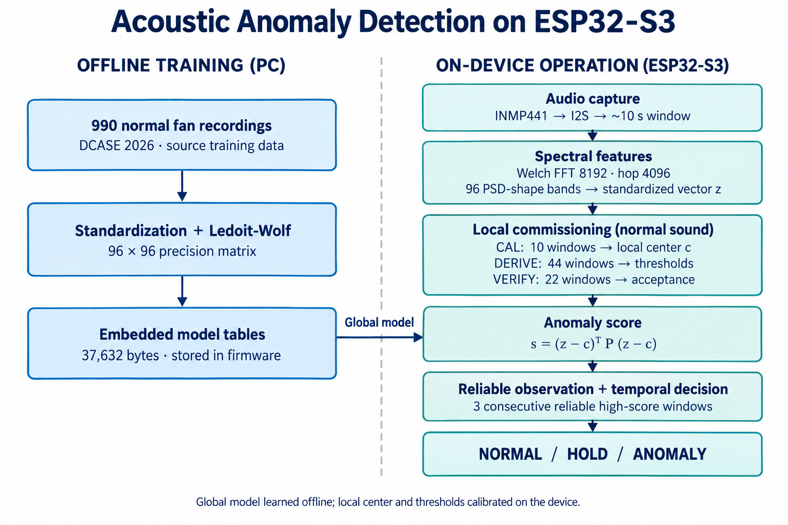
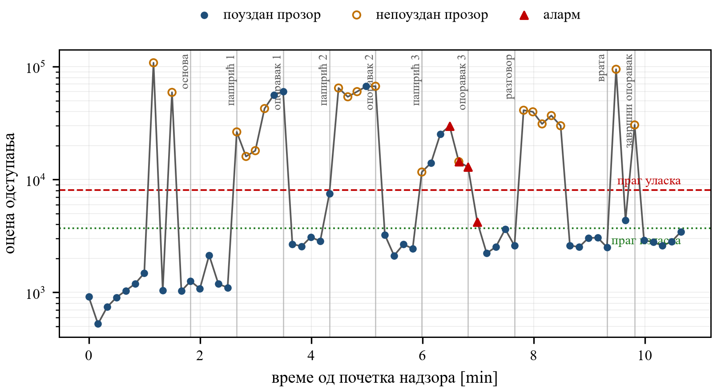
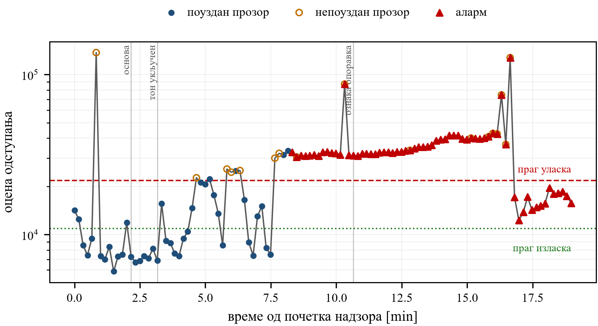

# Vodič za razgovor sa profesorom

**Verzija 5 · 28.09.2026.** Ovaj fajl je moj podsjetnik. Profesoru otvorim **PREZENTACIJA-PROFESORU.md** iz istog foldera u Markdown Preview-u (`Ctrl+Shift+V`). Sekcije i slike su iste u oba dokumenta.

**Vrijeme:** 16 minuta izlaganja + 3–4 minuta pitanja. Kod pokazujem kratko na označenim mjestima; dodatne funkcije otvaram samo ako pita.

## Prije sastanka

Otvorim prezentaciju, normalne WAV podatke, model header i CSV tonske probe. Za kod kliknem link fajla, pa `Ctrl+G` i upišem broj linije. Linije su provjerene u trenutnom kodu 28.09.2026.

Ako donosim uređaj, pripremu završim ranije: [POKRENI-GUIDED25.cmd](../../scripts/POKRENI-GUIDED25.cmd), stvarni COM port, normalan ventilator i nepromijenjen položaj mikrofona. CAL → DERIVE → VERIFY traje oko 13,6 minuta i ne staje u plan kratkog izlaganja.

## 1. Cilj i realizovani sistem — 2 minuta

**Kažem:** „Napravio sam uređaj koji sluša ventilator i prepoznaje održanu promjenu njegovog zvuka. Mikrofon, računanje i odluka rade lokalno na ESP32-S3.“

**Pokazujem lijevo pa desno:** „Lijevo je učenje modela iz normalnih snimaka na računaru. Te brojeve ugradim u firmware. Desno uređaj preuzima zvuk, računa opis spektra, prilagodi se normalnom ventilatoru i zatim prati odstupanje.“

Na slici su **z** novi opis zvuka, **c** lokalni normalni centar i **P** ugrađena matrica. Iz njih nastaje jedna ocjena, **score**. Plavo označava PC pripremu, zeleno rad uređaja. Detalje formule preskočim ako ih ne traži.

## 2. Podaci i model — 3 minuta

**Kažem:** „Koristio sam DCASE 2026 snimke ventilatora. Globalnu statistiku učim iz 990 normalnih source snimaka. Anomalije služe evaluaciji. Finalni model opisuje oblik spektra kroz 96 vrijednosti i mjeri koliko novi opis odstupa od normale.“

**Pokažem dva mjesta:**

| Šta otvorim | Šta pokažem |
|---|---|
| [data/dcase2026_dev/fan/train](../../data/dcase2026_dev/fan/train) | jedan normalan WAV i njegovo ime; audio pustim samo kratko ako je korisno |
| [psd_model_data.h](../../firmware/esp32s3_asd/main/psd_model_data.h) | linija **18**: sredine; **33**: standardne devijacije; **48**: matrica 96 × 96 |

**Za Embedded model tables sa slike kažem:** „To su ova tri niza: `asd_psd_norm_mean`, `asd_psd_norm_std` i `asd_psd_precision`. Ukupno imaju 37632 bajta i ugrađeni su u firmware. Lokalni centar i pragovi uče se naknadno na konkretnom ventilatoru.“

Ako pita za nastanak modela: [gen_psd_model_header.py](../../pc/tools/gen_psd_model_header.py), linija **57** bira source snimke, a **64** računa Ledoit–Wolf matricu. [Meta JSON](../../models/fan_psd_shape_meta.json) bilježi porijeklo. Lokalni WAV podaci nijesu uključeni u Git klon.

## 3. Kako uređaj donosi odluku — 3 minuta

**Kažem:** „Iz oko deset sekundi zvuka računam prosječan spektar, odnosno Welch, pa 96 PSD-shape vrijednosti. Mahalanobis daje jedan score odstupanja. Tokom pripreme CAL uči lokalni centar, DERIVE pragove, a VERIFY provjerava normalu. Nakon toga profil ostaje zamrznut.“

Pokažem tabelu **10 + 44 + 22** u prezentaciji, pa kažem: „Jedan visok score nije dovoljan. Potrebna su tri uzastopna pouzdana visoka prozora. HOLD prekida taj niz kod nestabilnog posmatranja, ali ne gasi automatski postojeći alarm. Iz alarma se izlazi preko nižeg praga.“

**Kratko pokažem:** [psd_live.c](../../firmware/esp32s3_asd/main/psd_live.c), linija **501**, `score_with_center()` — ugrađene tabele, novo obilježje i lokalni centar predaju se računu score-a.

**Samo ako pita za implementaciju:**

| Funkcija / parametar | Fajl i linija |
|---|---|
| početak programa, `app_main()` | [app_main.c](../../firmware/esp32s3_asd/main/app_main.c), **137**; poziv PSD toka **173** |
| uzorkovanje 16 kHz | [audio_i2s.h](../../firmware/esp32s3_asd/main/audio_i2s.h), **12** |
| FFT 8192, hop 4096, 96 traka | [psd_features_c.h](../../firmware/esp32s3_asd/main/psd_features_c.h), **7** |
| račun Mahalanobis score-a | [psd_features_c.c](../../firmware/esp32s3_asd/main/psd_features_c.c), **245**, `asd_psd_score()` |
| niz prozora iznad praga | [asd_temporal.c](../../firmware/esp32s3_asd/main/asd_temporal.c), **97** |

## 4. Razvojni rezultati na računaru — 2 minuta

**Kažem:** „Raniji autoenkoder imao je slabo razdvajanje. PSD-shape je dao razvojni AUC oko 0,856, a odvojena PC referenca oko 0,867. AUC nije procenat tačnosti. Ovo su različiti protokoli i razvojni rezultati, pa posebno pokazujem fizičke probe.“

Ako traži izvor broja: [advanced_results.json](../../results/advanced/advanced_results.json), linija **84**, `psd_shape`. Za drugu referencu: [aggregate_summary.csv](../../results/canonical_evaluation/canonical-evaluation-v1.1.0_m7-e7dedc81_k20_s100_sr20260809_b2000_br20260810_ms92dcebb5_src285b8c84_dep3eec7eed_datae3eb5bd5_195c0f34f7e6/aggregate_summary.csv), red `fan`, `psd_shape`. Firmware koristi k=10 za centar, PC referenca k=20.

Dodam: „Provjerio sam računanje istih obilježja u Pythonu i C-u. Na uređaju obrada i score traju oko 716 ms po desetosekundnom klipu.“ Ako pita za test: [test_psd_features_c.py](../../pc/tests/test_psd_features_c.py), linija **121**. Vrijeme računanja nije ukupno kašnjenje alarma.

## 5. Fizičke probe — 5 minuta

### Papirić

**Prvo objasnim ose i boje:** „X je vrijeme, y score na logaritamskoj skali. Crvena linija je prag ulaska, zelena izlaska. Plave tačke su pouzdani prozori, narandžasti krugovi HOLD, a crveni trouglovi alarm.“

**Pokažem tri bloka:** „Promjena se vidi u score-u, ali HOLD često prekida izgradnju alarma. Alarm je nastao u jednom od tri bloka i prenio se u oporavak. Zato je GUIDED25 FAIL.“

Ako pita za dokaz: [detections.csv — papirić](../../results/physical_fan/run_20260827T213148_fan02_guided25-20260827-v3recovery5d/detections.csv) i [guided25_report.json](../../results/physical_fan/run_20260827T213148_fan02_guided25-20260827-v3recovery5d/guided25_report.json).

### Ton

**Pokažem rast, alarm i završni pad:** „Stabilan ton od 1 kHz doveo je do dva ulaska u alarm i prijave održane promjene. Pri kraju score pada ispod ulaznog, ali ostaje iznad izlaznog praga. Povratak u normalu nije potvrđen. Ton je stvarno trajao još oko šest minuta poslije oznake oporavka.“

**Otvorim [detections.csv — ton](../../results/physical_fan/run_20260827T220338_fan02_tone-validation-20260827-final/detections.csv)** i kratko pokažem `condition`, `score`, `threshold`, `hold`, `alarm`: uslov, ocjena, prag, zadržavanje i alarm. Uporedim normalan red sa redom tokom tona. Kašnjenje od fizičkog početka tona nije izmjereno.

## 6. Zaključak i naredni korak — 1 minut

**Kažem:** „Realizovan je cijeli tok od mikrofona do autonomne odluke. Uređaj otkriva određene održane promjene, ali nestabilne promjene i oporavak još traže rad. Jedna postavka nije potvrda mehaničkog kvara ni dugoročne pouzdanosti.“

**Pitam:** „Da li biste prvo uradili nezavisnu probu na drugom ventilatoru ili doradu kalibracije i oporavka? Šta biste izdvojili kao glavni doprinos rada?“

Ostavim 3–4 minuta za pitanja. Potrošnju pominjem samo ako pita: validno mjerenje kompletnog detektora još nije završeno.
