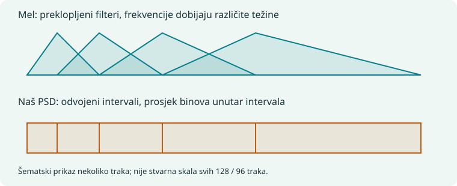
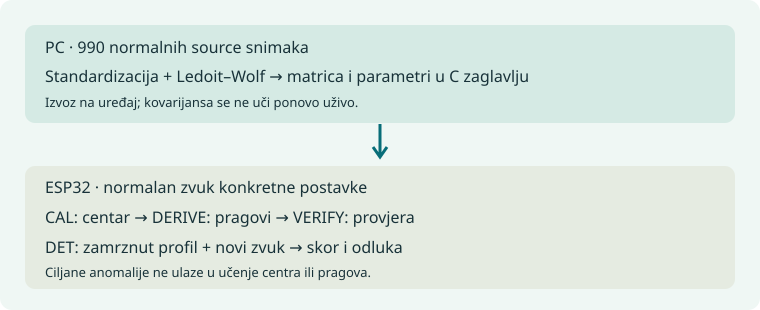

# Vodič za razgovor sa profesorom

**Projekat:** detekcija anomalija u zvuku na ESP32-S3. **Pripremljeno:** 24.09.2026.

Ovo je redosljed kojim mogu da pričam i pokazujem kod. Pasusi **„Kažem“** su moja glavna priča; objašnjenja ispod služe ako profesor postavi pitanje. Ne treba čitati svaki red koda: dovoljno je pokazati označenu funkciju i objasniti šta ulazi i šta izlazi.

Putanje se odnose na `C:\Users\mihaj\Desktop\master new`, granu `master`, stanje `9ef7052`. Izuzetak je novi E5 mjerni firmware, koji je posebno označen jer je na drugoj grani. Brojevi su iz sačuvanih eksperimenata, nijesu novo mjerenje urađeno prilikom pisanja vodiča.

## 0. Prva rečenica i mapa priče

**Kažem:** „Napravio sam uređaj koji sluša ventilator, upozna njegov normalan zvuk i zatim provjerava da li se taj zvuk trajno promijenio. Mikrofon, obrada i odluka rade na ESP32-S3. Na računaru sam razvijao i poređivao modele, a na uređaju se obavlja lokalna kalibracija i nadzor.“

```text
                        RAZVOJ NA RAČUNARU
 DCASE normalni WAV → obilježja → učenje statistike → C zaglavlje
                                                       │
                         RAD NA UREĐAJU                 ▼
 ventilator → INMP441 → I2S → PCM → Hann + FFT → Welch spektar
     → 96 PSD-shape vrijednosti → Mahalanobis ocjena → provjere → LED
                                          ↑
                         normalan zvuk lokalnog ventilatora
                         → centar + pragovi + provjera kalibracije
```

**Redosljed izlaganja:** hardver → uzorkovanje → obrada zvuka → istorija modela → finalni model → odluka → dokazi → TELFOR → mjerenje potrošnje. To je redosljed objašnjavanja sistema, ne tvrdnja da je finalni PSD bio prvi napisan. Prvi pokušaji koristili su log-mel i autoenkoder.

## 1. Kako sam postavio i pokrenuo sistem

**Kažem:** „Koristio sam ESP32-S3 sa PSRAM-om i digitalni MEMS mikrofon INMP441. Prvo sam definisao pinove, podesio I2S prijem i odvojio prikupljanje zvuka od obrade. Uzorci ulaze u kružni bafer, a obrada ih preuzima po blokovima.“

| Veza | ESP32-S3 | Čemu služi |
|---|---:|---|
| INMP441 SCK/BCLK | GPIO4 | takt za slanje bitova |
| INMP441 WS | GPIO5 | označava audio slot/kanal |
| INMP441 SD | GPIO6 | digitalni podaci mikrofona |
| INMP441 L/R | GND | bira lijevi slot koji firmware čita |
| Zelena / crvena LED | GPIO2 / GPIO11 | status / alarm |
| Taster | GPIO10 | pokretanje učenja |
| INA226 SDA / SCL | GPIO8 / GPIO9 | I2C mjernog senzora |

Mikrofon se napaja sa 3,3 V uz zajedničku masu. **Pinove otvaram ovdje:**

[C:\Users\mihaj\Desktop\master new\firmware\esp32s3_asd\main\pins.h](<C:/Users/mihaj/Desktop/master new/firmware/esp32s3_asd/main/pins.h:29>) (linije 29–37)

```c
#if CONFIG_IDF_TARGET_ESP32S3
#define PIN_I2S_BCLK  4
#define PIN_I2S_WS    5
#define PIN_I2S_DIN   6
#define PIN_I2C_SDA   8
#define PIN_I2C_SCL   9
#define PIN_LED       2
#define PIN_LED_ALARM 11
#define PIN_BUTTON    10
```

**Početak finalnog toka:** `app_main()` poziva inicijalizaciju, pokreće prikupljanje i ulazi u `psd_live_run()`. `ASD_PSD_VERIFY` je poseban provjerni tok; normalan finalni rad bira `ASD_PSD_LIVE`.

[C:\Users\mihaj\Desktop\master new\firmware\esp32s3_asd\main\app_main.c](<C:/Users/mihaj/Desktop/master new/firmware/esp32s3_asd/main/app_main.c:169>) (linije 169–178)

```c
#if defined(ASD_PSD_LIVE) || defined(ASD_PSD_VERIFY)
    ESP_ERROR_CHECK(audio_i2s_init());
    ESP_ERROR_CHECK(audio_i2s_start());
#ifdef ASD_PSD_VERIFY
    psd_verify_run();
#else
    psd_live_run();
#endif
    while (1) vTaskDelay(portMAX_DELAY);
#endif
```

Bafer traje približno dvije sekunde: `16000 × 2 × 2 bajta = 64000 bajtova`. On amortizuje kratko kašnjenje obrade; nije isto što i desetosekundni analizirani klip. `audio_i2s_init()` pokušava PSRAM pa SRAM, a `audio_i2s_start()` pokreće `capture_task` na jezgru 0.

## 2. I2S, PCM i gdje sam zadao 16 kHz

**Kažem:** „I2S je način kojim digitalni mikrofon šalje zvuk ESP32-u. PCM su sami brojevi koje dobijem: svaki broj govori kolika je amplituda zvuka u jednom trenutku. Podesio sam 16000 uzoraka u sekundi.“

```text
zvuk:       ~~~ talas ~~~
PCM:        0, 120, 230, 150, -30, -180, ...
vrijeme:    svaki sljedeći broj dolazi za 1/16000 s = 62,5 µs
I2S:        žice i takt kojim ti brojevi stižu do ESP32-a
```

**Ne podešavam INMP441 preko I2C registara:** ESP32 daje I2S taktove i bira format prijema; mikrofon ih prati. INA226 kasnije koristi drugi interfejs — I2C.

`AUDIO_SR` je u zaglavlju:

[C:\Users\mihaj\Desktop\master new\firmware\esp32s3_asd\main\audio_i2s.h](<C:/Users/mihaj/Desktop/master new/firmware/esp32s3_asd/main/audio_i2s.h:12>) (linije 12–16)

```c
#define AUDIO_SR         16000
#define AUDIO_RING_SEC   2                       /* ring buffer kapacitet */
#define AUDIO_RING_LEN   (AUDIO_SR * AUDIO_RING_SEC)
#define AUDIO_READ_DEFAULT_TIMEOUT_MS 2000u
#define AUDIO_I2S_CAPTURE_WAIT_MS      250u
```

`audio_i2s_init()` bira master, Philips format, 32-bitni slot i lijevi kanal:

[C:\Users\mihaj\Desktop\master new\firmware\esp32s3_asd\main\audio_i2s.c](<C:/Users/mihaj/Desktop/master new/firmware/esp32s3_asd/main/audio_i2s.c:117>) (linije 117–137)

```c

    i2s_chan_config_t chan_cfg = I2S_CHANNEL_DEFAULT_CONFIG(I2S_NUM_AUTO, I2S_ROLE_MASTER);
    chan_cfg.dma_desc_num = DMA_DESC_NUM;
    chan_cfg.dma_frame_num = DMA_FRAME_NUM;
    ESP_ERROR_CHECK(i2s_new_channel(&chan_cfg, NULL, &rx_chan));

    i2s_std_config_t std_cfg = {
        .clk_cfg = I2S_STD_CLK_DEFAULT_CONFIG(AUDIO_SR),
        .slot_cfg = I2S_STD_PHILIPS_SLOT_DEFAULT_CONFIG(I2S_DATA_BIT_WIDTH_32BIT,
                                                        I2S_SLOT_MODE_MONO),
        .gpio_cfg = {
            .mclk = I2S_GPIO_UNUSED,
            .bclk = PIN_I2S_BCLK,
            .ws = PIN_I2S_WS,
            .dout = I2S_GPIO_UNUSED,
            .din = PIN_I2S_DIN,
        },
    };
    /* INMP441 L/R na GND -> podaci u lijevom slotu */
    std_cfg.slot_cfg.slot_mask = I2S_STD_SLOT_LEFT;
    ESP_ERROR_CHECK(i2s_channel_init_std_mode(rx_chan, &std_cfg));
```

**32-bitni slot nije 32-bitni korisni zvuk.** Mikrofon šalje 24-bitni podatak u tom slotu. Ovdje ga postojeća implementacija pomjera i svodi na 16-bitni PCM; pomjeraj je dio konkretne skale signala, nije univerzalna I2S formula.

[C:\Users\mihaj\Desktop\master new\firmware\esp32s3_asd\main\audio_i2s.c](<C:/Users/mihaj/Desktop/master new/firmware/esp32s3_asd/main/audio_i2s.c:92>) (linije 92–99)

```c
        for (size_t i = off; i < n; i++) {
            int32_t a = raw[i] < 0 ? -raw[i] : raw[i];
            if (a > raw_peak) raw_peak = a;
            pcm[i - off] = (int16_t)(raw[i] >> 14);
        }
        size_t out = n - off;
        if (xRingbufferSend(ring, pcm, out * sizeof(int16_t), 0) != pdTRUE)
            dropped += out;
```

`dropped` bilježi uzorke koji nijesu stali u bafer. Pri validaciji posmatram porast broja izgubljenih uzoraka tokom analiziranog prozora, uz ostale provjere kvaliteta, a ne samo ukupni brojač od paljenja.

## 3. Nyquist — šta sam time uzeo u obzir

**Kažem:** „Sa uzorkovanjem od 16 kHz mogu predstavljati frekvencije ispod 8 kHz. To je Nyquistova granica. Finalni opis zvuka koristio sam u užem opsegu, od 10 do 4000 Hz.“

Za oblik jednog ponavljanja talasa trebaju uzorci dovoljno gusto raspoređeni. Ako je talas prebrz za izabrano uzorkovanje, može izgledati kao sporiji: to je **aliasing**. Tačno dva uzorka po periodi su granični slučaj, ne obećanje pouzdanog mjerenja na samih 8 kHz.

**Gdje je u kodu?** Ne postoji funkcija `nyquist()`. Ograničenje slijedi iz `AUDIO_SR=16000`; izbor korisnog opsega vidi se u `psd_features_c.c` kao `PSD_MIN_HZ=10.0` i `PSD_MAX_HZ=4000.0`. Izbacivanje visokih FFT binova poslije uzorkovanja nije zamjena za antialias filtriranje prije smanjenja frekvencije uzorkovanja.

## 4. Od PCM-a do FFT-a: šta je prozor, bin i 8192

**Kažem:** „PCM pokazuje kako se amplituda mijenja kroz vrijeme. FFT isti komad zvuka predstavlja kao kombinaciju frekvencija. Umjesto da gledam svaki uzorak, gledam koliko su zastupljene pojedine frekvencije.“

```text
PCM u vremenu                  FFT → snaga po frekvenciji
amplituda                      snaga
  /\/\_/\/\                      │       █
 /        \                      │   █   █       █
────────────→ vrijeme            └──────────────────→ Hz
  8192 uzorka                        50  100     200
```

**Prozor/segment** je 8192 uzastopna PCM uzorka, odnosno `8192/16000 = 0,512 s` zvuka. **Bin** je jedna pozicija FFT rezultata, vezana za frekvenciju `k × fs/N`. Npr. bin 512 odgovara `512 × 16000/8192 = 1000 Hz`. Ton između binova doprinosi susjednim binovima; bin nije savršena izolovana kutijica koja prihvata samo jednu frekvenciju.

| Parametar | Raniji log-mel tok | Finalni PSD tok |
|---|---:|---:|
| N, uzoraka po FFT-u | 1024 | 8192 |
| Trajanje segmenta | 64 ms | 512 ms |
| Razmak binova `fs/N` | 15,625 Hz | 1,953125 Hz |

**Zašto 8192?** To je `2^13`, pa odgovara implementiranoj radix-2 FFT, daje gušći raspored frekvencija i ostaje izvodljivo na ESP32-S3. Za približno stacionaran ventilator to je koristan kompromis: bolje opisujem uske spektralne promjene, ali lošije određujem u kom kratkom trenutku su nastale. Stvarna sposobnost razdvajanja dva tona zavisi i od Hann prozora, ne samo razmaka binova.

Nijesmo dokazali da je 8192 univerzalno optimalno. Uspjeh je rezultat promjene cijelog opisa — duži FFT, Welch, trake i normalizacija — a ne eksperiment koji izoluje samo broj N.

[C:\Users\mihaj\Desktop\master new\firmware\esp32s3_asd\main\psd_features_c.h](<C:/Users/mihaj/Desktop/master new/firmware/esp32s3_asd/main/psd_features_c.h:8>) (linije 8–10)

```c
#define ASD_PSD_N_FFT 8192
#define ASD_PSD_HOP 4096
#define ASD_PSD_BANDS 96
```

**Otvaram FFT:** [C:\Users\mihaj\Desktop\master new\firmware\esp32s3_asd\main\psd_features_c.c](<C:/Users/mihaj/Desktop/master new/firmware/esp32s3_asd/main/psd_features_c.c>) — funkcija `psd_fft()`. U njoj se dijelovi dužine 2, 4, 8… spajaju do 8192; ne moram profesoru ručno izvoditi leptir-operacije.

[C:\Users\mihaj\Desktop\master new\firmware\esp32s3_asd\main\psd_features_c.c](<C:/Users/mihaj/Desktop/master new/firmware/esp32s3_asd/main/psd_features_c.c:33>) (linije 33–45)

```c
    for (int len = 2; len <= ASD_PSD_N_FFT; len <<= 1) {
        int half = len >> 1;
        int step = ASD_PSD_N_FFT / len;
        for (int i = 0; i < ASD_PSD_N_FFT; i += len) {
            for (int k = 0; k < half; k++) {
                float wr = tw_re[k * step], wi = tw_im[k * step];
                int a = i + k, b = a + half;
                float xr = fft_re[b] * wr - fft_im[b] * wi;
                float xi = fft_re[b] * wi + fft_im[b] * wr;
                fft_re[b] = fft_re[a] - xr;
                fft_im[b] = fft_im[a] - xi;
                fft_re[a] += xr;
                fft_im[a] += xi;
```

## 5. Hann i 50% preklapanja — nema izdvojene „prave sredine“

**Kažem:** „Prije FFT-a postepeno stišam krajeve segmenta Hann prozorom. Time ublažavam vještački nagli prekid na granicama. Sljedeći segment počinje na polovini prethodnog, tako da zvuk koji je bio blizu slabije ponderisanog kraja bude bliže sredini drugog segmenta.“

```text
PCM blokovi:   A          B          C          D
segment 1:    [A          B]                  8192 uzorka
segment 2:               [B          C]       pomak 4096
segment 3:                          [C          D]

Hann težine u svakom segmentu:     0  /‾‾\  0
                                       1
isti blok B ulazi u dva segmenta, svaki put sa drugim težinama
```

Ne odsijecam krajeve i ne čuvam posebnu nepreklopljenu sredinu. Koristim cijeli ponderisani segment. U sredini dugog snimka uzorci se pojavljuju u dva susjedna segmenta; početak i kraj imaju rubne izuzetke. Kod Welch-a prosječim **snage spektara**, ne spajam nazad audio signal, pa ovo nije dokaz savršene rekonstrukcije talasa.

**Hann formula u `asd_psd_init()`:**

[C:\Users\mihaj\Desktop\master new\firmware\esp32s3_asd\main\psd_features_c.c](<C:/Users/mihaj/Desktop/master new/firmware/esp32s3_asd/main/psd_features_c.c:60>) (linije 60–61)

```c
        hann[i] = (float)(0.5 - 0.5 * cos(2.0 * M_PI * (double)i /
                                        (double)ASD_PSD_N_FFT));
```

**Stvarno preklapanje u `asd_psd_stream_push_hop()`:**

[C:\Users\mihaj\Desktop\master new\firmware\esp32s3_asd\main\psd_features_c.c](<C:/Users/mihaj/Desktop/master new/firmware/esp32s3_asd/main/psd_features_c.c:209>) (linije 209–223)

```c
int asd_psd_stream_push_hop(const float *hop) {
    int done = 0;
    if (stream_have_prev) {
        /* prozor = [prethodni hop | tekuci hop] */
        for (int i = 0; i < ASD_PSD_HOP; i++) fft_re[i] = stream_prev[i];
        for (int i = 0; i < ASD_PSD_HOP; i++) fft_re[ASD_PSD_HOP + i] = hop[i];
        psd_accumulate_segment();
        if (stream_sidecar_enabled) sidecar_accumulate_segment(stream_segments);
        stream_segments++;
        done = 1;
    }
    memcpy(stream_prev, hop, sizeof(stream_prev));
    stream_have_prev = 1;
    return done;
}
```

## 6. Welch, PSD i PSD shape

**Kažem:** „Jedan FFT može dosta zavisiti od trenutka koji sam uhvatio. Zato iz približno deset sekundi zvuka računam više preklopljenih FFT-ova, pretvaram ih u snagu i prosječim. To je Welch postupak. Dobijam stabilniji opis rasporeda snage po frekvencijama.“

**PSD** znači *power spectral density*, odnosno raspodjela snage po frekvenciji. Koristan je za pitanje: „U kojim djelovima spektra se promjena najviše vidi?“ Preciznost za ovaj projekat: naziv PSD koristimo za ovaj tok, ali referentni poziv ima `scaling="spectrum"`, pa numerički daje **spektar snage**, ne gustinu izraženu po Hz. Nije kalibrisano mjerenje akustičke snage u vatima niti zvučnog pritiska u paskalima.

**PC referenca — `periodic_features()`:**

[C:\Users\mihaj\Desktop\master new\pc\tools\bench_periodicity.py](<C:/Users/mihaj/Desktop/master new/pc/tools/bench_periodicity.py:56>) (linije 56–58)

```python
    f, p = welch(y, fs=SR, window="hann", nperseg=8192, noverlap=4096,
                 detrend=False, scaling="spectrum")
    psd = _band_log_power(f, p, np.geomspace(10.0, 4000.0, 97))
```

**ESP32 — Hann, FFT, pa `real² + imag²`:**

[C:\Users\mihaj\Desktop\master new\firmware\esp32s3_asd\main\psd_features_c.c](<C:/Users/mihaj/Desktop/master new/firmware/esp32s3_asd/main/psd_features_c.c:86>) (linije 86–94)

```c
static void psd_accumulate_segment(void) {
    for (int i = 0; i < ASD_PSD_N_FFT; i++) {
        fft_re[i] *= hann[i];
        fft_im[i] = 0.0f;
    }
    psd_fft();
    for (int bin = 0; bin <= ASD_PSD_N_FFT / 2; bin++)
        power_sum[bin] += fft_re[bin] * fft_re[bin] + fft_im[bin] * fft_im[bin];
}
```

Finalni klip sadrži 39 blokova od 4096 uzoraka: 159744 uzorka, oko 9,984 s. Od njih nastaje **38 preklopljenih FFT segmenata**. Nemoj zamijeniti FFT segment od 512 ms i prozor odluke od približno 10 s.

Zatim spektar sažimam u **96 logaritamskih traka između 10 i 4000 Hz**. U svakoj uzimam srednju snagu, logaritam i na kraju oduzimam jednu zajedničku srednju vrijednost tog klipa. Tako naglašavam **oblik**, a umanjujem uticaj opšte glasnoće.

```text
primjer radi razumijevanja, nije izmjeren podatak:
log snage u tri trake:       [2, 5, 2]   sredina 3 → shape [-1, 2, -1]
sve tri podignute za 4:      [6, 9, 6]   sredina 7 → shape [-1, 2, -1]
jedna traka promijenjena:    [2, 8, 2]   sredina 4 → shape [-2, 4, -2]
```

**Otvaram `psd_finalize()`:**

[C:\Users\mihaj\Desktop\master new\firmware\esp32s3_asd\main\psd_features_c.c](<C:/Users/mihaj/Desktop/master new/firmware/esp32s3_asd/main/psd_features_c.c:110>) (linije 110–122)

```c
            float sum = 0.0f;
            int first = band_start[band];
            for (int i = 0; i < count; i++) sum += power_sum[first + i];
            float mean_power = scale * sum / (float)count;
            out_feature[band] = log10f(mean_power + 1e-20f);
        }
        feature_mean += out_feature[band];
    }
    feature_mean /= (float)ASD_PSD_BANDS;
    for (int band = 0; band < ASD_PSD_BANDS; band++) out_feature[band] -= feature_mean;
    return segments;
}

```

Ovo nije potpuna otpornost na udaljenost, šum ili glasnoću. U zamrznutoj implementaciji osam veoma uskih donjih traka nema FFT bin i dobija pod −20 prije centriranja, što dodatno ograničava idealnu invarijantnost. Eksperimenti s ne-praznim trakama su odvojeni; ne predstavljam ih kao već potvrđen finalni uređaj.

**Veza s rotacionim mašinama:** ponavljanje obrtanja i prolaz lopatica mogu stvarati tonove i harmonike. Njihova promjena može promijeniti spektralni oblik. To je motivacija za detaljniji frekvencijski opis. Bez tahometra i potvrđenog kvara ne tvrdim da svaki vrh znači brzinu vratila ili konkretan kvar ležaja.

## 7. STFT i mel trake — raniji ulaz u neuronsku mrežu

**Kažem:** „Prije finalnog PSD-a koristio sam log-mel spektrogram. STFT znači da FFT ponavljam kroz vrijeme i zadržavam svaki rezultat, pa vidim i frekvenciju i vrijeme. Mel filteri zatim grupišu frekvencije u preklopljene trake.“

```text
             STFT: sačuvam svaki trenutak      Welch: prosječim kroz vrijeme
vrijeme 1 → [slabo, jako, slabo]             ┐
vrijeme 2 → [slabo, jako, jako ]             ├→ jedan prosječan spektar
vrijeme 3 → [slabo, jako, slabo]             ┘

mel filteri:       /\    /\      /\          ponderisani preklopljeni trouglovi
                 /  \  /  \    /  \         širi prema višim frekvencijama
```

Mel traka sabira frekvencijske komponente sa različitim težinama. Na nižim frekvencijama raspored je gušći, a na višim širi, prema mel skali povezanoj sa ljudskim sluhom. To je sažimanje zvuka, nije model koji sam odlučuje šta je anomalija.

[C:\Users\mihaj\Desktop\master new\pc\asd\features.py](<C:/Users/mihaj/Desktop/master new/pc/asd/features.py:51>) (linije 51–56)

```python
    n_frames = 1 + (len(y) - n_fft) // hop
    win = hann_window(n_fft)
    idx = np.arange(n_fft)[None, :] + hop * np.arange(n_frames)[:, None]
    frames = y[idx] * win[None, :]
    spec = np.fft.rfft(frames, n=n_fft, axis=1)
    return (np.abs(spec) ** 2).astype(np.float32)
```

[C:\Users\mihaj\Desktop\master new\pc\asd\features.py](<C:/Users/mihaj/Desktop/master new/pc/asd/features.py:63>) (linije 63–65)

```python
    p = stft_power(y)
    mel = p @ mel_filterbank().T
    return ((20.0 / POWER) * np.log10(mel + LOG_EPS)).astype(np.float32)
```

Rani AE: 128 mel traka × 5 susjednih frejmova = **640 ulaznih brojeva**. Finalni model: **96 PSD-shape brojeva za cijeli klip**. To nijesu iste trake niti dva imena za isti ulaz.



## 8. DCASE podaci i kako sam učio autoenkoder

**Kažem:** „Za razvoj sam koristio DCASE 2026 Task 2 podatke, prvenstveno ventilator. Normalni snimci služe za učenje, a odvojeni normalni i anomalni snimci za ocjenu. Source i target predstavljaju različite domene uslova rada ili primjeraka, pa me zanimalo kako se model prenosi na novu mašinu.“

**Učitavanje:** [C:\Users\mihaj\Desktop\master new\pc\asd\data.py](<C:/Users/mihaj/Desktop/master new/pc/asd/data.py>) — `list_clips()`, `parse_clip()`, `load_features()`, `fit_norm()`. Ime WAV-a sadrži split, domen i oznaku normal/anomaly. Podaci su pod `C:\Users\mihaj\Desktop\master new\data\dcase2026_dev\fan\`.

**Kažem za AE:** „Autoenkoder dobija normalan opis zvuka i uči da ga rekonstruiše. Nadam se da će nepoznato odstupanje rekonstruisati lošije. Anomaly score je greška između ulaza i rekonstruisanog izlaza.“

```text
640 log-mel brojeva → encoder → 8 brojeva → decoder → 640 rekonstruisanih
       x                                                  x̂
                 greška = prosjek (x − x̂)²
```

**Trening, funkcija `main()`:** oba argumenta `m.fit(x, x)` su ista, jer je cilj rekonstrukcija ulaza.

[C:\Users\mihaj\Desktop\master new\pc\asd\train.py](<C:/Users/mihaj/Desktop/master new/pc/asd/train.py:43>) (linije 43–56)

```python
    train_clips = data.list_clips(machine_dir, "train")
    test_clips = data.list_clips(machine_dir, "test")
    train_feats = data.load_features(train_clips, cache_dir / f"{machine}_train.npz", "train feats")
    test_feats = data.load_features(test_clips, cache_dir / f"{machine}_test.npz", "test feats")

    mean, std = data.fit_norm(train_feats)
    x = np.concatenate([(f - mean) / std for f in train_feats], axis=0)

    m = mdl.build_ae(input_dim=x.shape[1], **mdl.SWEEP[args.variant])
    n_params = m.count_params()
    t0 = time.time()
    m.fit(x, x, epochs=args.epochs, batch_size=args.batch, validation_split=0.1,
          shuffle=True, verbose=2)
    train_time = time.time() - t0
```

Ovaj AE kod uzima normalni `train` split koji mu je dostavljen; ne treba na njega automatski prenijeti tvrdnju „samo 990 source snimaka“. Eksplicitan izbor tih 990 postoji u finalnom PSD exporteru u poglavlju 11.

**Arhitektura:** [C:\Users\mihaj\Desktop\master new\pc\asd\model.py](<C:/Users/mihaj/Desktop/master new/pc/asd/model.py>) — `build_ae()`. Skriveni slojevi sažimaju pa rekonstrušu ulaz; izlaz ima isti broj elemenata kao ulaz.

[C:\Users\mihaj\Desktop\master new\pc\asd\model.py](<C:/Users/mihaj/Desktop/master new/pc/asd/model.py:19>) (linije 19–28)

```python
        x = layers.Dense(width, name=f"enc_{i}")(x)
        x = layers.BatchNormalization(name=f"enc_bn_{i}")(x)
        x = layers.ReLU(name=f"enc_relu_{i}")(x)
    x = layers.Dense(bottleneck, name="bottleneck")(x)
    x = layers.BatchNormalization(name="bn_bottleneck")(x)
    x = layers.ReLU(name="relu_bottleneck")(x)
    for i in range(depth):
        x = layers.Dense(width, name=f"dec_{i}")(x)
        x = layers.BatchNormalization(name=f"dec_bn_{i}")(x)
        x = layers.ReLU(name=f"dec_relu_{i}")(x)
```

**Šta nije radilo dovoljno dobro?** Mala rekonstrukciona greška ne garantuje zdravu mašinu: mreža može dobro rekonstruisati i anomaliju, ili loše rekonstruisati normalan zvuk iz drugog domena. Rezultati pokazuju slabo razdvajanje; to nije dokaz da autoenkoderi generalno ne rade za ovaj zadatak.

**Otvaram stvarne redove rezultata:** [C:\Users\mihaj\Desktop\master new\results\results.csv](<C:/Users/mihaj/Desktop/master new/results/results.csv>).

| Red iz CSV-a | Target AUC |
|---|---:|
| `fan_baseline_s0`, `mse`, `fp32` | 0,4682 |
| isti baseline, `int8` | 0,4694 |
| `fan_tiny32_s0`, `fp32` | 0,4516 |

Oko 0,5 znači približno slučajno rangiranje normalnih i anomalnih snimaka. **AUC nije procenat tačnosti.** Stariji pregled `docs/put-do-modela.md` navodi oko 0,451 kao početnu AE brojku; za pokazivanje konkretnog baseline reda koristim CSV i 0,4682, da ne miješam varijante.

## 9. Keras, TFLite i ostali pokušaji

**Kažem:** „Keras sam koristio da definišem i treniram mrežu. Zatim sam je pretvarao u TFLite, uključujući int8 varijantu, da smanjim memoriju i pripremim izvršavanje na uređaju. To su alati i formati, a ne tri različita modela.“

**Otvaram `convert()`:**

[C:\Users\mihaj\Desktop\master new\pc\asd\quantize.py](<C:/Users/mihaj/Desktop/master new/pc/asd/quantize.py:22>) (linije 22–37)

```python
def convert(keras_path: Path, rep_data: np.ndarray | None) -> bytes:
    import tensorflow as tf
    m = tf.keras.models.load_model(keras_path)
    conv = tf.lite.TFLiteConverter.from_keras_model(m)
    if rep_data is not None:
        conv.optimizations = [tf.lite.Optimize.DEFAULT]

        def rep():
            for i in range(0, len(rep_data), 1):
                yield [rep_data[i:i + 1].astype(np.float32)]
        conv.representative_dataset = rep
        conv.target_spec.supported_ops = [tf.lite.OpsSet.TFLITE_BUILTINS_INT8]
        conv.inference_input_type = tf.int8
        conv.inference_output_type = tf.int8
    return conv.convert()

```

Reprezentativni normalni ulazi određuju skalu kvantizacije. Float vrijednosti se približavaju cijelim brojevima; poslije konverzije ponovo mjerim AUC. Ovdje je slabo razdvajanje postojalo već u float modelu, pa kvantizacija nije glavni uzrok odustajanja od AE-a.

Uređajski neuronski tok otvaram u [C:\Users\mihaj\Desktop\master new\firmware\esp32s3_asd\main\tflm_infer.cc](<C:/Users/mihaj/Desktop/master new/firmware/esp32s3_asd/main/tflm_infer.cc>), funkcije `tflm_init()` i `tflm_score_vector()`. Finalni `ASD_PSD_LIVE` iz `app_main.c` ulazi u PSD tok prije inicijalizacije TFLM-a: **finalni detektor nema neuronsku mrežu u putanji odluke**.

**Nijesam pokušao samo AE i finalni PSD.** Ovo je sažeta mapa, a ne lista svih eksperimenata za čitanje naglas:

| Pokušaj | Šta sam mijenjao / provjeravao | Gdje pokazujem |
|---|---|---|
| AE baseline, tiny64, tiny32, tiny16, tiny32b4 | širinu, dubinu i usko grlo mreže | `pc/asd/model.py`, `SWEEP`; `results/results.csv` |
| Naučeni embedding | mreža uči opis kroz razlikovanje mašina/režima | `pc/tools/train_embed.py` |
| Samonadzirani/atributski klasifikator, uključujući brzine | pokušaj da pomoćni zadatak nauči korisniji opis | `pc/tools/train_ssl.py`; istorija u `docs/put-do-modela.md` |
| Mel statistika + različite udaljenosti | puna/dijagonalna kovarijansa, Ledoit–Wolf, PPCA, kNN, robustna kovarijansa, pooling, medijana centra | `pc/tools/bench_research.py` do `bench_research6.py` |
| PSD, envelope i njihove kombinacije | promjena samog opisa signala | `pc/tools/bench_periodicity.py` |
| Order, log-ratio, coherence, masked, transient varijante | dodatne fizički motivisane ideje | `pc/tools/evaluate_advanced.py`; `results/advanced/advanced_results.json` |

Pune putanje za dodatne pokušaje:

- [C:\Users\mihaj\Desktop\master new\pc\tools\train_embed.py](<C:/Users/mihaj/Desktop/master new/pc/tools/train_embed.py>)
- [C:\Users\mihaj\Desktop\master new\pc\tools\train_ssl.py](<C:/Users/mihaj/Desktop/master new/pc/tools/train_ssl.py>)
- [C:\Users\mihaj\Desktop\master new\pc\tools\bench_research.py](<C:/Users/mihaj/Desktop/master new/pc/tools/bench_research.py>)
- [C:\Users\mihaj\Desktop\master new\pc\tools\bench_research_final.py](<C:/Users/mihaj/Desktop/master new/pc/tools/bench_research_final.py>)
- [C:\Users\mihaj\Desktop\master new\pc\tools\evaluate_advanced.py](<C:/Users/mihaj/Desktop/master new/pc/tools/evaluate_advanced.py>)
- [C:\Users\mihaj\Desktop\master new\docs\put-do-modela.md](<C:/Users/mihaj/Desktop/master new/docs/put-do-modela.md>)

**Konkretan drugi zadatak učenja:** u `train_ssl.py` cilj `Y` je oznaka radnog režima, a ne rekonstrukcija `X`. Zato se koristi klasifikacioni gubitak. Oznake brzine izvlači `attr_of()` iz imena snimka.

[C:\Users\mihaj\Desktop\master new\pc\tools\train_ssl.py](<C:/Users/mihaj/Desktop/master new/pc/tools/train_ssl.py:109>) (linije 109–113)

```python
    model = build_classifier(X.shape[1], n_cls)
    model.compile(optimizer=tf.keras.optimizers.Adam(1e-3),
                  loss="sparse_categorical_crossentropy", metrics=["accuracy"])
    hist = model.fit(X, Y, batch_size=512, epochs=args.epochs, validation_split=0.1,
                     verbose=2)
```

Istorijski pregled navodi približno 0,495 za embedding, 0,530 za klasifikator brzina i oko 0,5 za samonadzirani pokušaj. To su istorijske bilješke, ne jedna zajednička tabela pod identičnim protokolom. Ne proglašavam uzrok svakog neuspjeha dokazanim samo na osnovu AUC-a.

**Glavna pouka koju kažem:** „Promjena načina predstavljanja zvuka bila je važnija od dodavanja složenijeg modela. Statistički model nad pogodnijim obilježjem bio je bolji izbor za ovaj ventilator.“

## 10. Euklidska udaljenost, kovarijansa i Mahalanobis

**Kažem:** „Finalni model poredi novi opis zvuka sa normalnim. Ne gledam samo koliko se svaki broj promijenio, nego i da li su se trake promijenile zajedno na način koji je inače normalan.“

**Euklidska udaljenost:** obična pravolinijska udaljenost. Poslije standardizacije svaku osu tretira jednako i ne zna koje vrijednosti obično rastu zajedno.

**Kovarijansa:** opis zajedničkog mijenjanja. Ako se kod normalnog ventilatora dvije trake obično pojačaju zajedno, takvo pomjeranje nije jednako neobično kao da jedna poraste, a druga jako padne. Dijagonala matrice govori koliko svaka vrijednost varira; ostali elementi opisuju njihove veze.

```text
traka B
  ↑                  o o      normalni opisi leže uz dijagonalu
  │               o o         pomjeranje DUŽ nje je očekivanije
  │            o o
  │         o o        X      X je van uobičajenog odnosa A i B
  └──────────────────────→ traka A
```

**Mahalanobisova udaljenost** uzima u obzir širinu i smjer ovog oblaka. Ista obična udaljenost od centra može biti mala anomalija u smjeru česte promjene, a velika u smjeru rijetke promjene.

U kodu računam **kvadrat** udaljenosti: `score = dᵀ × precision × d`, gdje je `precision` inverzna kovarijansa. Nema potrebe za korijenom jer poređenje sa pragom može raditi u kvadriranoj skali.

[C:\Users\mihaj\Desktop\master new\firmware\esp32s3_asd\main\psd_features_c.c](<C:/Users/mihaj/Desktop/master new/firmware/esp32s3_asd/main/psd_features_c.c:245>) (linije 245–261)

```c
float asd_psd_score(const float *feature, const float *norm_mean,
                    const float *norm_std, const float *precision,
                    const float *local_center, int dim) {
    static float delta[ASD_PSD_BANDS];
    static float projected[ASD_PSD_BANDS];
    if (dim > ASD_PSD_BANDS) return NAN;
    for (int i = 0; i < dim; i++)
        delta[i] = (feature[i] - norm_mean[i]) / norm_std[i] - local_center[i];
    for (int i = 0; i < dim; i++) {
        float sum = 0.0f;
        for (int j = 0; j < dim; j++) sum += precision[i * dim + j] * delta[j];
        projected[i] = sum;
    }
    float score = 0.0f;
    for (int i = 0; i < dim; i++) score += delta[i] * projected[i];
    return score;
}
```

Na ovoj funkciji pokazujem tri koraka: normalizuj obilježje → oduzmi lokalni centar → izračunaj jednu ocjenu odstupanja.

## 11. Ledoit–Wolf i šta se uči na PC-u, a šta na ESP32-u

**Kažem:** „Oblik normalnih varijacija učim unaprijed iz mnogo normalnih DCASE snimaka. Na lokalnom ventilatoru ne učim cijelu matricu iz deset klipova, nego prvenstveno njegov centar. Tako razdvajam ono za šta trebaju stotine snimaka od prilagođavanja konkretnom uređaju.“

**Ledoit–Wolf** je stabilnija procjena kovarijanse. Izmjerenu matricu malo približava jednostavnijoj, ravnomjernijoj matrici. Time smanjuje pretjerano oslanjanje na odnose koji su možda slučajni u konačnom skupu podataka i olakšava pouzdano invertovanje. Nije poseban alarm niti neuronski sloj.

**PC učenje i izvoz, `gen_psd_model_header.py`:**

[C:\Users\mihaj\Desktop\master new\pc\tools\gen_psd_model_header.py](<C:/Users/mihaj/Desktop/master new/pc/tools/gen_psd_model_header.py:56>) (linije 56–68)

```python
    train_features = all_features[:len(clips)]
    source = train_features[domains == "source"].astype(np.float64)
    if source.shape != (990, DIM):
        raise ValueError(f"očekivano (990,{DIM}), dobijeno {source.shape}")

    mean = source.mean(axis=0)
    std = source.std(axis=0) + 1e-8
    normalized = (source - mean) / std
    precision = LedoitWolf().fit(normalized).precision_

    mean32 = mean.astype(np.float32)
    std32 = std.astype(np.float32)
    precision32 = precision.astype(np.float32)
```

Izlaz koji uređaj uključuje: [C:\Users\mihaj\Desktop\master new\firmware\esp32s3_asd\main\psd_model_data.h](<C:/Users/mihaj/Desktop/master new/firmware/esp32s3_asd/main/psd_model_data.h>). Sadrži normalizacione vrijednosti i matricu `96 × 96`. Sama float32 matrica zauzima `96 × 96 × 4 = 36864` bajta.

**Lokalni centar u `psd_live.c`:**

[C:\Users\mihaj\Desktop\master new\firmware\esp32s3_asd\main\psd_live.c](<C:/Users/mihaj/Desktop/master new/firmware/esp32s3_asd/main/psd_live.c:820>) (linije 820–825)

```c
    for (int d = 0; d < DIM; d++) {
        float s = 0.0f;
        for (int i = 0; i < N_CAL; i++)
            s += (cal_feat[i][d] - asd_psd_norm_mean[d]) / asd_psd_norm_std[d];
        center[d] = s / (float)N_CAL;
    }
```

Ovo je početna sredina 10 normalnih klipova; poslije nje kod provjerava kalibraciju i može primijeniti K1 odbacivanje dva najproblematičnija klipa. Leave-one-out ocjena izostavlja klip iz centra kojim se taj klip provjerava, da provjera ne bude vještački povoljna.

**Važna razlika:** učenje centra nije cijela priprema. Finalni commissioning zatim koristi **44 normalna DERIVE prozora** za pragove i **22 odvojena VERIFY prozora** za provjeru. Zato je zabilježena priprema oko **13,6 minuta**, a ne samo 100 sekundi.

Otvaram [C:\Users\mihaj\Desktop\master new\firmware\esp32s3_asd\main\asd_commissioning.c](<C:/Users/mihaj/Desktop/master new/firmware/esp32s3_asd/main/asd_commissioning.c>) — politika `derive_windows=44`, `verify_windows=22`; pragove otvaram u `psd_live.c`, `threshold_enter = percentile_higher(...)`. Tokom nadzora centar i pragovi ostaju zamrznuti: uređaj ne smije postepeno usvojiti anomaliju kao novo normalno stanje.



## 12. Kada se pali alarm i šta znači HOLD

**Kažem:** „Jedan visok rezultat nije dovoljan. Tražim tri uzastopna pouzdana prozora iznad ulaznog praga. Za izlazak iz alarma koristim niži prag, da LED ne treperi kada je rezultat blizu granice.“

```text
visok, pouzdan score:       DA → DA → DA → ALARM
prekid normale:            DA → NE → DA → još nema alarma
nepouzdano posmatranje:     DA → HOLD → DA → niz počinje ponovo
```

**Otvaram `asd_temporal_update()` u `asd_temporal.c`:**

[C:\Users\mihaj\Desktop\master new\firmware\esp32s3_asd\main\asd_temporal.c](<C:/Users/mihaj/Desktop/master new/firmware/esp32s3_asd/main/asd_temporal.c:86>) (linije 86–98)

```c
    if (det->active) {
        /* Histereza: iz alarma se izlazi tek ispod NIŽEG praga. Bez toga
         * score koji visi oko praga pali i gasi alarm iz prozora u prozor. */
        if (statistic <= threshold_exit) {
            det->active = 0;
            det->run = 0;
            det->cusum = 0.0f;
        }
    } else {
        /* Strogo veće, isto kao ranije u psd_live.c: score tačno na pragu je
         * normalan. */
        det->run = statistic > threshold_enter ? det->run + 1 : 0;
        int fired = det->run >= det->policy.min_consecutive;
```

`min_consecutive` u izabranoj politici postavljen je na 3. Tri prozora znače približno 30 s pouzdanih visokih ocjena, **ne automatski izmjereno vrijeme od fizičkog početka promjene**. Promjena može početi usred prozora, ostati ispod praga ili izazvati HOLD.

**Zašto HOLD?** Klip dijelim i na kraće grupe segmenata. Ako je visok score praćen neuobičajeno velikom nestabilnošću među grupama, ne donosim novu pouzdanu odluku. To može pomoći kod govora i udarca vrata, ali može zadržati i stvarnu nestabilnu promjenu na ventilatoru.

[C:\Users\mihaj\Desktop\master new\firmware\esp32s3_asd\main\asd_interference.c](<C:/Users/mihaj/Desktop/master new/firmware/esp32s3_asd/main/asd_interference.c:83>) (linije 83–102)

```c
    if (!gate->policy.enabled || !obs->score_high) {
        asd_interference_reset(gate);
        return ASD_INTERFERENCE_PASS;
    }
    int unreliable =
        (gate->policy.use_tonalness_delta &&
         fabsf(obs->tonalness_delta) > gate->policy.max_abs_tonalness_delta) ||
        obs->subsegment_instability > gate->policy.max_subsegment_instability;
    if (!unreliable) {
        /* The next stable high window starts a fresh temporal run. */
        asd_interference_reset(gate);
        return ASD_INTERFERENCE_PASS;
    }
    gate->hold_active = 1;
    gate->hold_windows++;
    if (gate->hold_windows >= gate->policy.long_hold_windows) {
        gate->warning_emitted = 1;
        return ASD_INTERFERENCE_HOLD_WARNING;
    }
    return ASD_INTERFERENCE_HOLD;
```

HOLD nije oznaka „ovo je sigurno spoljna buka“: sa jednim mikrofonom nijesam odvojio izvore zvuka. Stabilan spoljni ton može izazvati alarm. HOLD prekida niz za ulazak i ne znači automatsko gašenje već aktivnog alarma. Posebne provjere kvaliteta audia i prisustva izvora prethode odluci; `dropped=0` sam nije dovoljan.

Ulazni prag se izvodi iz normalnog DERIVE bloka. Izlazni ima posebne granice i provjere u `psd_live.c`, oko `COMMISSION_EXIT_MAX_FRACTION`; istorijski offline odnos 0,7 nije pravilo finalnog firmvera. Poslije 12 pouzdanih alarmnih prozora emituje se `ANOMALY_SUSTAINED`.

## 13. Kako sam provjerio da PC i MCU računaju isto

**Kažem:** „Nijesam pretpostavio da portovanje iz Pythona u C daje isti rezultat. Isti WAV sam propustio kroz Python referencu i C implementaciju, uporedio svih 96 obilježja, zatim provjerio da streaming odgovara batch obradi. Postoji i zaseban verifikacioni tok na ESP32.“

[C:\Users\mihaj\Desktop\master new\pc\tests\test_psd_features_c.py](<C:/Users/mihaj/Desktop/master new/pc/tests/test_psd_features_c.py:121>) (linije 121–135)

```python
def test_psd_real_wav_pc_vs_c(clib):
    clips = fan_clips_or_skip()
    path = clips[0].path
    y, sr = sf.read(path, dtype="float32", always_2d=True)
    assert sr == 16000
    y = np.ascontiguousarray(y[:, 0])
    out = np.zeros(96, np.float32)
    segments = clib.asd_psd_extract(
        y.ctypes.data_as(ctypes.POINTER(ctypes.c_float)), ctypes.c_int(len(y)),
        out.ctypes.data_as(ctypes.POINTER(ctypes.c_float)))
    ref = periodic_features(path)["psd_shape"].astype(np.float32)
    max_diff = float(np.max(np.abs(ref - out)))
    print(f"segments={segments} max|PC-C|={max_diff:.3e}")
    assert segments == 38
    assert max_diff < 2e-3
```

Ovo je **C biblioteka pokrenuta na PC-u**, ne samo po sebi dokaz izvršavanja na MCU-u. Za uređaj otvaram [C:\Users\mihaj\Desktop\master new\firmware\esp32s3_asd\main\psd_verify.c](<C:/Users/mihaj/Desktop/master new/firmware/esp32s3_asd/main/psd_verify.c>) i `ASD_PSD_VERIFY` granu iz `app_main.c`.

U [C:\Users\mihaj\Desktop\master new\docs\istrazivanje-psd-model.md](<C:/Users/mihaj/Desktop/master new/docs/istrazivanje-psd-model.md>) sačuvana je PC↔C maksimalna razlika obilježja **9,54 × 10⁻⁷**. To je izmjerena razlika u tom testu; `2e-3` u prikazanom assert-u je dozvoljena tolerancija, ne izmjeren rezultat. Mala numerička razlika dokazuje slaganje računanja na provjerenom ulazu, ne kvalitet detekcije i ne ispravnost svakog novog snimanja.

**Provjera na samoj ploči:** [C:\Users\mihaj\Desktop\master new\docs\hardver-verifikacija.md](<C:/Users/mihaj/Desktop/master new/docs/hardver-verifikacija.md>), odjeljak „PC↔uređaj na živom mikrofonu“. Uređaj je poslao isti snimljeni PCM i svoj feature, a [C:\Users\mihaj\Desktop\master new\pc\tools\psd_verify_compare.py](<C:/Users/mihaj/Desktop/master new/pc/tools/psd_verify_compare.py>) je ponovio račun na PC-u. Sačuvani rezultat je `max |PC - uredjaj| = 1,698e-06`, uz provjeru prenosa snimka. Dokument je iz ranije faze: ovdje koristim dokaz numeričkog slaganja, ne njegove stare pragove i šire zaključke kao opis finalne politike.

## 14. ROC, AUC i koje rezultate pokazujem

**Kažem:** „Model prvo daje broj odstupanja. Kad mijenjam prag, mijenjam koliko anomalija otkrivam i koliko normalnih snimaka pogrešno proglašavam anomalijama. ROC prikazuje taj odnos, a AUC sažima koliko dobro score rangira anomalije iznad normale.“

```text
niži prag → više otkrivenih anomalija, ali obično i više lažnih alarma
viši prag → manje lažnih alarma, ali mogu propustiti anomalije

ROC: x = udio lažnih alarma među normalnim snimcima
     y = udio otkrivenih anomalija među anomalnim snimcima
AUC: 0,5 približno slučajno rangiranje; 1 savršeno rangiranje u tom skupu
```

AUC 0,856 **ne znači 85,6% tačnosti niti 85,6% otkrivenih kvarova**. Za stvarni alarm treba izabrati prag; kod nas se uređajski prag bira iz normalnih podataka. pAUC dodatno posmatra dio ROC-a sa malim udjelom lažnih alarma; ovdje je standardizovani pAUC za FPR ≤ 0,1.

[C:\Users\mihaj\Desktop\master new\pc\asd\eval.py](<C:/Users/mihaj/Desktop/master new/pc/asd/eval.py:47>) (linije 47–56)

```python
def dcase_metrics(scores: np.ndarray, labels: np.ndarray, domains: np.ndarray) -> dict:
    """AUC_source, AUC_target (normal iz domena + SVE anomalije), pAUC, harmonijska sredina."""
    res = {}
    for dom in ("source", "target"):
        mask = ((domains == dom) & (labels == 0)) | (labels == 1)
        res[f"auc_{dom}"] = roc_auc_score(labels[mask], scores[mask])
    res["pauc"] = roc_auc_score(labels, scores, max_fpr=P_AUC_FPR)
    vals = [res["auc_source"], res["auc_target"], res["pauc"]]
    res["hmean"] = stats.hmean(vals)
    return res
```

Ovo je zajednička ideja metrike prikazana u AE evaluaciji. Za noviju tabelu kandidata konkretan račun AUC-a nalazi se u [C:\Users\mihaj\Desktop\master new\pc\tools\evaluate_advanced.py](<C:/Users/mihaj/Desktop/master new/pc/tools/evaluate_advanced.py>), `main()`, poziv `roc_auc_score(labels, scores)`; `partial_auc()` računa ograničeni dio ROC-a.

**Rezultati koje otvaram, ovim redom:**

1. [C:\Users\mihaj\Desktop\master new\results\results.csv](<C:/Users/mihaj/Desktop/master new/results/results.csv>) — raniji AE i kvantizovane varijante. Pokazujem da slabo rangiranje postoji prije int8 konverzije.
2. [C:\Users\mihaj\Desktop\master new\results\advanced\advanced_results.json](<C:/Users/mihaj/Desktop/master new/results/advanced/advanced_results.json>) — 20 razvojnih podjela: `psd_shape` AUC **0,8556**, pAUC **0,6393**; `psd_plus_transient` AUC **0,85676**. Dodatak transient obilježja ima mali numerički plus, ne dokazanu značajnu prednost. Zato ne kažem da je čisti PSD pobijedio baš svaku varijantu.
3. [C:\Users\mihaj\Desktop\master new\results\canonical_evaluation\canonical-evaluation-v1.1.0_m7-e7dedc81_k20_s100_sr20260809_b2000_br20260810_ms92dcebb5_src285b8c84_dep3eec7eed_datae3eb5bd5_195c0f34f7e6\SUMMARY.md](<C:/Users/mihaj/Desktop/master new/results/canonical_evaluation/canonical-evaluation-v1.1.0_m7-e7dedc81_k20_s100_sr20260809_b2000_br20260810_ms92dcebb5_src285b8c84_dep3eec7eed_datae3eb5bd5_195c0f34f7e6/SUMMARY.md>) — 100 podjela, k=20: fan PSD **0,8666**, mel1280 **0,6270**, mel256 **0,5897**, sa istim backendom u tom poređenju. Ovo su statistički mel modeli, **ne AE**. Na ToyCar PSD je **0,4479**, pa ne tvrdim da je najbolji za sve mašine.
4. [C:\Users\mihaj\Desktop\master new\docs\rezultat-finalna-validacija-2026-08-27.md](<C:/Users/mihaj/Desktop/master new/docs/rezultat-finalna-validacija-2026-08-27.md>) — ono što se stvarno desilo na fizičkom ventilatoru.

Brojevi 0,8556 i 0,8666 nijesu kontradikcija: različiti su protokoli i podjele. Ovi skupovi su korišćeni tokom razvoja, pa postoje istorijska pristrasnost izbora modela i ograničenje nezavisnosti. **Učenje samo na normali nije isto što i potpuno slijep razvoj bez ikakvog uvida u anomalne rezultate.**

### Šta je fizički dokazano, a šta nije

**Kažem:** „Uređaj sam ispitao na fizičkom ventilatoru. Stabilna promjena uz reprodukovani ton od 1 kHz dovela je do alarma. Za nestabilnu promjenu pomoću papirne trake rezultat je bio slabiji: propisani test nije prošao. To mi pokazuje i ograničenje pravila koje zadržava nepouzdane prozore.“

| Nalaz | Šta smijem zaključiti |
|---|---|
| Ton: dva alarmna događaja i sustained događaj | uređaj može otkriti održanu promjenu zvuka |
| Papirna traka: alarm u 1 od 3 propisana bloka; GUIDED25 `FAIL` | ova fizička provjera nije uspješno završena |
| Govor i vrata bez alarma u malom broju prozora | koristan ograničen nalaz, ne opšti dokaz otpornosti na buku |
| `compute_ms` približno 716–728 ms | vrijeme računanja obilježja i ocjene, ne ukupno kašnjenje alarma |
| Validna telemetrija | mjerenje se može analizirati; to ne znači da je detektor položio test |

**Sirovi dokazi za ton:** [C:\Users\mihaj\Desktop\master new\results\physical_fan\run_20260827T220338_fan02_tone-validation-20260827-final\SUMMARY.md](<C:/Users/mihaj/Desktop/master new/results/physical_fan/run_20260827T220338_fan02_tone-validation-20260827-final/SUMMARY.md>). U istom folderu su `detections.csv`, događaji i serijski logovi. Papirni test i poređenje oba prolaza objašnjeni su u navedenom izvještaju finalne validacije.

**Završni tehnički zaključak:** PSD-shape + Ledoit–Wolf/Mahalanobis je kompaktan i na razvojnim fan podacima bolji izbor od pregledanih ranijih pristupa. Lokalna kalibracija i kontrola kvaliteta omogućavaju autonoman rad. I dalje nijesam dokazao pouzdanu dijagnostiku konkretnog mehaničkog kvara, opštu otpornost na okolinu ili dugotrajnu stabilnost na više nezavisnih ventilatora.

## 15. Kako da otvorim razgovor o TELFOR radu

**Kažem:** „Mislio sam da rad fokusiram na cijeli put od normalnih podataka do autonomnog detektora na ESP32-S3: izbor obilježja, prenos računanja na uređaj, lokalnu kalibraciju i fizičku provjeru. Kao glavni rezultat bih pokazao šta sistem stvarno otkriva, ali i slučajeve gdje HOLD i oporavak ograničavaju rad. Da li je to dobar fokus za TELFOR ili da suzim priču?“

Ovo je prijedlog fokusa koji mogu izgovoriti iako nacrt već postoji; ne treba tvrditi da nacrt nije napisan. **Postojeći tekst** je u [C:\Users\mihaj\Desktop\master new\radovi\telfor2026\build_paper.py](<C:/Users/mihaj/Desktop/master new/radovi/telfor2026/build_paper.py>) — `TITLE`, `ABSTRACT`, `BODY`, a status pripreme u [C:\Users\mihaj\Desktop\master new\radovi\telfor2026\PREOSTALO-RAD.md](<C:/Users/mihaj/Desktop/master new/radovi/telfor2026/PREOSTALO-RAD.md>).

Naslov nacrta: **Anomalous Sound Detection on an ESP32-S3: Normal-Only Design and Measured Failure Modes**.

U njemu su već obuhvaćeni:

- arhitektura sa jednim mikrofonom i finalni Welch/Mahalanobis tok;
- razvojno poređenje osam kandidata na 20 podjela i ograničenje na ventilator;
- posebno poređenje temporalnih politika, gdje su kratke promjene simulirane u score-u, ne stvarni govor;
- lokalna priprema 10 + 44 + 22 prozora i izvršavanje na ESP32;
- dva fizička prolaza: papirna traka i ton, uključujući neuspješan GUIDED25;
- dvije ilustracije: putanja signala i score kroz tonski prolaz; tri tabele kandidata, temporalnih pravila i fizičkih rezultata;
- otvorena pitanja: ponovljivost pragova, izlazak iz alarma, nezavisne mašine i potrošnja kompletnog toka.

**Pitanja za profesora:**

1. Da li je glavni doprinos dovoljno jasno postavljen kao realizacija i provjera autonomnog sistema, ili treba izdvojiti uži doprinos u izboru obilježja?
2. Da li u kratkom radu zadržati samo kratak osvrt na AE, a detaljnu istoriju modela ostaviti za master?
3. Da li je najkorisniji sljedeći eksperiment nezavisni ventilator, potvrđen kvar ili poboljšanje oporavka i kalibracije?
4. Da li uključiti E5 potrošnju ako dobijem validno mjerenje na vrijeme, i prikazati energiju cijelog prozora ili i raspodjelu po fazama?

**Moj prijedlog:** za TELFOR zadržati jednu jasnu priču i poštene fizičke rezultate. Ne dodavati nove modele samo da bi spisak bio duži. Potrošnju dodati tek kada mjerni lanac bude provjeren; sada je mogu predstaviti kao konkretan sljedeći korak.

## 16. Mjerna ploča koju sam napravio i šta slijedi

**Kažem:** „Napravio sam i zalemio odvojenu mjernu ploču da bih izmjerio potrošnju kompletnog uređaja. Na njoj su regulator AMS1117-3.3 i INA226 sa šantom R100, odnosno 0,1 Ω. Prije konačnih brojeva provjeriću naponsko i strujno mjerenje, pa izmjeriti energiju tokom stvarnog rada detektora.“

Lemljenje je trenutno stanje prema mojoj prijavi; samo po sebi ne potvrđuje tačnost mjerenja. Novija šema je ovdje: [C:\Users\mihaj\Desktop\master new\radno\elektronika\lemljenje-cjeline-i-mjerenje.md](<C:/Users/mihaj/Desktop/master new/radno/elektronika/lemljenje-cjeline-i-mjerenje.md>). Nosač je prototipna ploča 4 × 6 cm, moduli su na headerima, a dodatni 470 µF predviđen je kao vadiv.

```text
5 V → AMS1117-3.3 → čvor IZVOR 3,3 V → IN+ [šant 0,1 Ω] IN− → ESP32 3V3
                           │                              │
                           └→ INA226 VCC                  └→ INA226 VBS

sve mase → zajednička masa
INA226 SDA/SCL → ESP32 GPIO8/GPIO9
```

**VCC senzora ide prije šanta, VBS poslije.** Tako njegova VCC potrošnja ne ulazi u mjerenu granu. Mjerim uređaj i terete koji se napajaju iza šanta; ne mjerim gubitke regulatora ni ukupnu snagu uzetu iz 5 V izvora. Konačnu granicu mjerenja navodim uz rezultat.

INA226 mjeri mali pad napona preko poznatog otpornika: `I = Všant/R`. Napon potrošača mjeri preko VBS; iz napona i struje dobijam snagu. Energija je sabiranje snage kroz vrijeme: `E ≈ Σ P × Δt`. Ako je P u mW, a vrijeme u s, rezultat je mJ.

**Postojeći drajver, kalibracione konstante:**

[C:\Users\mihaj\Desktop\master new\firmware\esp32s3_asd\main\ina226.c](<C:/Users/mihaj/Desktop/master new/firmware/esp32s3_asd/main/ina226.c:21>) (linije 21–27)

```c
/* Kalibracija za R100 (0,1 Ω) i Current_LSB = 50 µA:
 *   CAL = 0.00512 / (Current_LSB * R_shunt) = 0.00512 / (50e-6 * 0.1) = 1024 */
#define CAL_VALUE       1024
#define CURRENT_LSB_UA  50
#define POWER_LSB_UW    (25 * CURRENT_LSB_UA)   /* datasheet: 25 × Current_LSB */
#define SHUNT_LSB_NV    2500                    /* 2,5 µV po bitu */
#define BUS_LSB_UV      1250                    /* 1,25 mV po bitu */
```

U istom fajlu otvaram `ina226_init()`, `ina226_current_ua()` i `ina226_power_uw()`. Stari dijagnostički tok je [C:\Users\mihaj\Desktop\master new\firmware\esp32s3_asd\main\ina226_test.c](<C:/Users/mihaj/Desktop/master new/firmware/esp32s3_asd/main/ina226_test.c>), `ina226_test_run()`.

### Šta već postoji za novo mjerenje

U grani **`measurement/e5-ina226`**, provjerenoj kroz lokalnu referencu `origin/measurement/e5-ina226`, postoje:

- [firmware/esp32s3_asd/main/e5_measure.c](https://github.com/mihajloz11/asd-esp32s3/blob/measurement/e5-ina226/firmware/esp32s3_asd/main/e5_measure.c) — mjerni overlay iza `ASD_E5_MEASURE`;
- [pc/tools/e5_capture.py](https://github.com/mihajloz11/asd-esp32s3/blob/measurement/e5-ina226/pc/tools/e5_capture.py) — prijem i obrada mjernih podataka;
- [results/mjerenje_2026-09-21/EXPERIMENT.md](https://github.com/mihajloz11/asd-esp32s3/blob/measurement/e5-ina226/results/mjerenje_2026-09-21/EXPERIMENT.md) — detaljan postupak;
- [results/mjerenje_2026-09-21/POVEZIVANJE.md](https://github.com/mihajloz11/asd-esp32s3/blob/measurement/e5-ina226/results/mjerenje_2026-09-21/POVEZIVANJE.md) — zabilježeno povezivanje.

**Ti fajlovi nijesu u trenutnom lokalnom `master` checkout-u.** Ne tražim `e5_measure.c` u njemu kao da već postoji. Dostupan je preko prikazane grane; u Git-u ga mogu pregledati i sa `git show origin/measurement/e5-ina226:firmware/esp32s3_asd/main/e5_measure.c` bez mijenjanja grane. Prema sačuvanom statusu build prolazi, ali taj E5 firmware još nije fizički potvrđen flešovanjem i mjerenjem.

Novi tok ima `E5CHECK` za kontrolna očitanja, `E5RUN` za 60 s mjerenja i naknadni ispis, te armirano mjerenje i trajno čuvanje. Označava `CAPTURE_WAIT`, `DSP`, `SCORE` i ostale/miješane intervale. GPIO12/13/14 služe kao markeri za logički analizator. `CAPTURE_WAIT` nije jedini trenutak rada mikrofona: I2S prikuplja zvuk i na drugom jezgru.

**Kako se energija stvarno računa u pripremljenom host alatu:** `pc/tools/e5_capture.py`, grana `measurement/e5-ina226`, linije 125–136. Iz dva susjedna očitanja uzima prosječnu snagu i množi stvarnim vremenskim razmakom (trapezna integracija).

```python
    for a, b in zip(samples, samples[1:]):
        dt = (b["trigger_us"] - a["trigger_us"]) / 1e6
        gaps.append(dt)
        if dt <= 0 or dt > 0.1:
            issues.append("nonmonotonic_or_large_gap")
            continue
        # Signed U*I avoids unsigned power register ambiguity on reverse flow.
        pa = a["bus_uv"] * a["current_ua"] / 1e6
        pb = b["bus_uv"] * b["current_ua"] / 1e6
        e = (pa + pb) * 0.5 * dt
        energy_uj += e
        covered_s += dt
```

### Redosljed koji predlažem za mjerenje

1. Provjerim spojeve i izlaz regulatora približno 3,3 V prije priključivanja ESP32-a. Za ovu AMS varijantu ulaz je 5,00 V, početni limit 0,30 A; 5 V ne vodim na ESP32 3V3.
2. Isključim USB napajanje ESP32-a da struja ne zaobiđe šant. Za konzolu koristim UART adapter sa 3,3 V signalima, zajedničkom masom i **bez spojenog VCC-a**. Za komande su potrebni i RX i TX.
3. Uporedim INA226 napon sa multimetrom direktno na mjernim tačkama. Protokol traži slaganje unutar ±10 mV. Struju provjerim nezavisno u istoj grani, ne samo na displeju 5 V izvora.
4. Snimim najmanje tri 60-sekundna ponavljanja po unaprijed definisanom stanju, sa istim ventilatorom, položajem, napajanjem i konfiguracijom. Posebno zabilježim dodatni kondenzator, LED i mjerni režim.
5. Prijavim srednju snagu, energiju cijelog intervala i označenih faza uz trajanje i mjerne greške. Zbog preklapanja prikupljanja i obrade ne tvrdim da je fazna energija isključivo potrošnja jedne funkcije.

Novi E5 koristi okidane konverzije, AVG=1, bus/shunt po 1,1 ms; stvarni razmak uzoraka dobija se iz vremena i I2C rada. Ne prepisujem mu staru konfiguraciju AVG=16 niti unaprijed tvrdim da postiže tačno 450 Hz. Mjerenje i samo opterećuje uređaj, pa treba procijeniti i taj doprinos.

**Prethodni dokaz:** [C:\Users\mihaj\Desktop\master new\radno\elektronika\e5-mjerenje-01-rezultat.md](<C:/Users/mihaj/Desktop/master new/radno/elektronika/e5-mjerenje-01-rezultat.md>) — stari I2C test, oko 34,73 mA **bez audia i modela**, sa problemom naponskog očitanja 3,425 V naspram oko 3,22 V. To nije finalna potrošnja detektora. Nova ploča može poboljšati kontakte, ali ponovljeno mjerenje tek treba da potvrdi da je problem riješen.

## 17. Završetak razgovora i kratki podsjetnik

**Kažem:** „Glavni rezultat mi je kompletan autonoman tok od mikrofona do odluke, sa provjerenim prenosom računanja i normal-only kalibracijom. Za ventilator se pogodniji opis spektra pokazao korisnijim od ranijih složenijih modela. Fizički testovi pokazuju da održana promjena može biti otkrivena, ali i da nestabilnost i povratak iz alarma traže još rada. Sljedeće bih završio validno mjerenje potrošnje i sa Vama odredio najvažniju nezavisnu provjeru.“

| Ako profesor pita… | Odgovor u jednoj rečenici |
|---|---|
| Gdje počinje program? | `app_main.c` → I2S init/start → `psd_live_run()` |
| Gdje je 16 kHz? | `audio_i2s.h`, `AUDIO_SR`, primijenjen u `audio_i2s_init()` |
| Gdje je Nyquist? | nije funkcija; 8 kHz slijedi iz fs=16 kHz |
| Šta je 8192? | broj stvarnih uzoraka u jednom FFT segmentu od 512 ms |
| Šta je jedan bin? | FFT koeficijent na frekvenciji `k × fs/N` |
| Šta radi Welch? | prosječi snage više preklopljenih, prozorovanih segmenata |
| Jesu li mel i PSD trake iste? | nijesu; rani tok je log-mel, finalni 96 logaritamskih PSD-shape traka |
| Gdje se uči finalni model? | `gen_psd_model_header.py`: 990 source normalnih opisa i Ledoit–Wolf |
| Šta ESP32 uči lokalno? | centar, pragove i referentne uslove normale, uz provjeru prihvatljivosti |
| Gdje je odluka? | Mahalanobis score + kvalitet/prisustvo + interference + temporalna politika |
| Da li ste dokazali kvar? | dokazao sam određene promjene zvuka; potvrđeni mehanički kvar nije dokazan |
| Kolika je potrošnja? | konačna potrošnja kompletnog detektora tek treba da se validno izmjeri |
