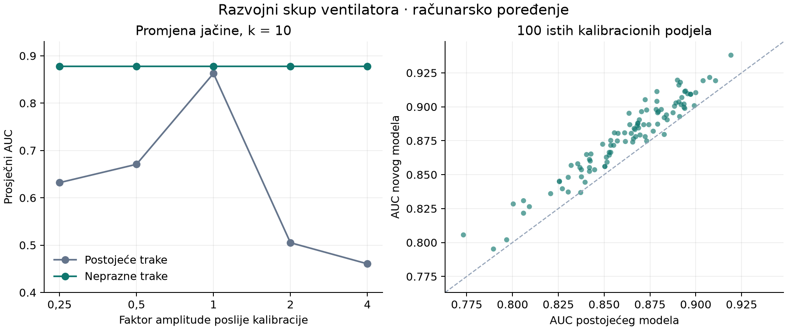

# Eksperiment sa nepraznim PSD trakama

07.09.2026. Grana: `codex/psd-nonempty-bands`.



Nova varijanta popravlja izmjereni problem normalizacije i daje bolje razvojno
rangiranje na postojećim snimcima ventilatora. To opravdava pripremu odvojenog
firmware-a za probu, ali još ne potvrđuje rezultat na fizičkom ventilatoru.

## Šta je promijenjeno

Postojeća mapa ima osam praznih traka. Njihova fiksna vrijednost −20 ulazi u
srednju vrijednost vektora i prenosi promjenu jačine na sva obilježja.
Nova mapa i dalje ima 96 traka: svaka granica napreduje najmanje jednu FFT
tačku. Ukupni opseg ostaje isti, binovi 6–2047, bez praznina ili preklapanja.
Promijenjena je 31 unutrašnja granica. Welch, logaritam, centriranje i
Ledoit–Wolf postupak ostaju isti. Oba modela su ponovo naučena.

## Poređenje

Fit: 990 source normalnih snimaka. Kalibracioni pool: 60 target normalnih.
Završno rangiranje: 50 target anomalnih. Za svaki k korišćeno je 100 istih
podjela za oba modela; kalibracioni snimci se izostavljaju iz ocjene.
Modeli i podjele zamrznuti su prije otvaranja anomalnih obilježja.

| Kalibracija | Postojeći AUC | Novi AUC | Postojeći pAUC | Novi pAUC |
|---|---:|---:|---:|---:|
| 10 prozora | 0,862764 ± 0,028392 | 0,877848 ± 0,028106 | 0,663726 | 0,681200 |
| 20 prozora | 0,866555 ± 0,026507 | 0,882465 ± 0,026987 | 0,666921 | 0,683737 |

pAUC je standardizovan pri FPR ≤ 0,1. ± označava rasipanje kroz podjele.
Za k=10 AUC raste u 98/100 podjela, a pAUC u 87/100; za k=20 u 100/100
i 84/100. To nisu nezavisne fizičke probe niti interval pouzdanosti za
populaciju ventilatora. Vrijednost k=10 razlikuje se od ranijih 0,8556 jer
ovdje ima 100 kanonskih podjela, a u ranijem poređenju 20 drugih podjela.
Kanonska k=20 osnova ponovljena je na 0,866555.

## Promjena jačine poslije kalibracije

Pojačanje se primjenjuje na ocjenjivane snimke; centar ostaje iz originalne
jačine. Množe se cijeli snimci, bez simulacije ADC zasićenja ili promjene
odnosa signal/šum. Ovo nije simulacija samo pojačavanja fizičkog tona.

| Faktor amplitude | Postojeći AUC, k=10 | Novi AUC, k=10 |
|---|---:|---:|
| 0,25 | 0,632036 | 0,877848 |
| 0,5 | 0,670756 | 0,877848 |
| 1 | 0,862764 | 0,877848 |
| 2 | 0,505100 | 0,877848 |
| 4 | 0,460516 | 0,877848 |

Na C implementaciji, jednom širokopojasnom signalu i šest normalnih WAV
snimaka, najveća promjena novog obilježja kroz ove faktore je 2,38e−6.
Najveće odstupanje Python–C je 3,78e−6, relativno odstupanje ocjene 4,82e−7,
a batch i streaming su identični. Posebno je provjeren sidecar svih pet grupa.
Dodavanje 1e−20 i dalje ograničava invarijantnost pri ekstremno malim snagama.

## Reprodukcija i trag podataka

Pokrenuti iz korijena ove grane, u Python okruženju projekta sa GCC-om:

```powershell
python pc/tools/evaluate_psd_nonempty.py --data-root data/dcase2026_dev --output results/psd_nonempty/ponovljeno
python -m pytest pc/tests/test_psd_nonempty.py pc/tests/test_psd_features_c.py -q
```

`--data-root` može pokazivati na postojeći skup u drugom radnom folderu.
Skript odbija prepisivanje završenog rezultata. Ne koristi stari pozicioni cache.
Normalizacija prati kanonski evaluator; pri skali manjoj od 1e−8 koristi 1.
Raniji FW izvoznik dodaje 1e−8 standardnoj devijaciji, pa novo poređenje ne
predstavlja doslovno izvršavanje starog ugrađenog zaglavlja na svim klipovima.

- [plan.json](plan.json): unaprijed definisana varijanta i kriterij računarskog prolaza.
- [frozen.json](frozen.json): hash modela, izvora i podjela prije anomalnih obilježja.
- [frozen_sources.zip](frozen_sources.zip): izvori računarske evaluacije, sa očuvanim bajtovima i završecima redova koji odgovaraju zamrznutim hash-evima.
- [bands.json](bands.json): sve granice i broj FFT tačaka po traci.
- [summary.json](summary.json), [per_split.csv](per_split.csv): sve metrike, uključujući slabije ishode.
- `splits_k10.json` i `splits_k20.json`: imena i SHA-256 ulaznih snimaka, cal/held podjele.
- [c_checks.json](c_checks.json): numeričke provjere na stvarnim normalnim snimcima i sintetičkom šumu.
- Dva `*_model.npz` fajla sadrže naučene normalizacije i matrice preciznosti.

Puna regresija nove grane: **479 prošlo, 5 preskočeno**; svih šest novih
testova prolazi. Pet postojećih provjera zavisi od lokalnog skupa/modela,
od čega su tri PSD provjere. Eksperiment iznad zasebno otvara stvarne snimke kroz
eksplicitni `--data-root`; tih šest WAV poređenja nije preskočeno.

## Dopuna provjera sa kompletnim podacima

Naknadno je svih pet ranije preskočenih testova izvršeno sa podacima iz
`master new/data` i kopijom postojećeg `fan_psd_shape.npz`. Kod i C izvori
uzeti su iz eksperimentalne grane; lokalni `data` junction pokazuje na
originalni skup. Model nije ponovo učen niti je original izmijenjen.

Ciljani skup od 16 testova (log-mel, postojeći PSD i novi PSD) prošao je
bez preskakanja: [pytest_with_data.txt](pytest_with_data.txt). Stvarni WAV:
log-mel max PC–C 3,81e−5 dB, PSD 9,537e−7; obje streaming provjere imaju
nultu razliku prema batch putanji. Relativna razlika PSD ocjene je 4,366e−7.
Ranijih 479 prolaza i ovih pet dopunjenih provjera pokrivaju svih 484
prikupljenih testova; cijeli skup nije ponovo pokretan u jednom pozivu.

## Granice zaključka

Ovo je već istraživani razvojni skup. Nije uveden novi nezavisan fizički test.
Nova mapa mijenja i niskofrekventnu rezoluciju, pa porast AUC pri originalnoj
jačini nije izolovan dokaz efekta samo uklanjanja praznih traka.
Postojeće fizičke probe čuvaju već agregirana obilježja; iz njih nije moguće
rekonstruisati novu mapu. Zato se ne tvrdi da su popravljeni papirić,
prihvatanje kalibracije, HOLD ili oporavak. Njihove politike nisu podešavane.

Radni firmware u izvornom projektu ostaje sačuvan. Eksperimentalni model
zahtijeva novu lokalnu kalibraciju; stari centar i pragovi ne prenose se.

Eksperimentalna integracija i postupak naredne probe: [FW-PROBA.md](FW-PROBA.md).
`summary.json` bilježi stanje poslije računarske evaluacije, prije integracije;
zaseban `firmware_package.json` opisuje naknadno napravljeni build. Izvor C
provjere iz `frozen.json` sačuvan je u commitu `3af7f34`; poslije toga uklonjena
je zabrana ESP builda i dodat izbor odgovarajućeg modela. Raspored traka nije mijenjan.
